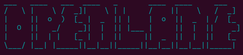
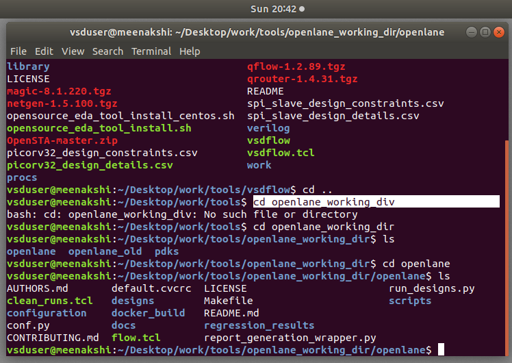
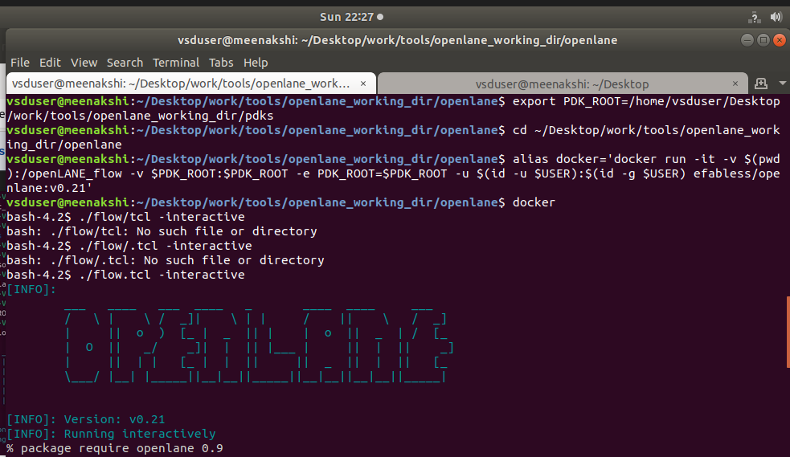
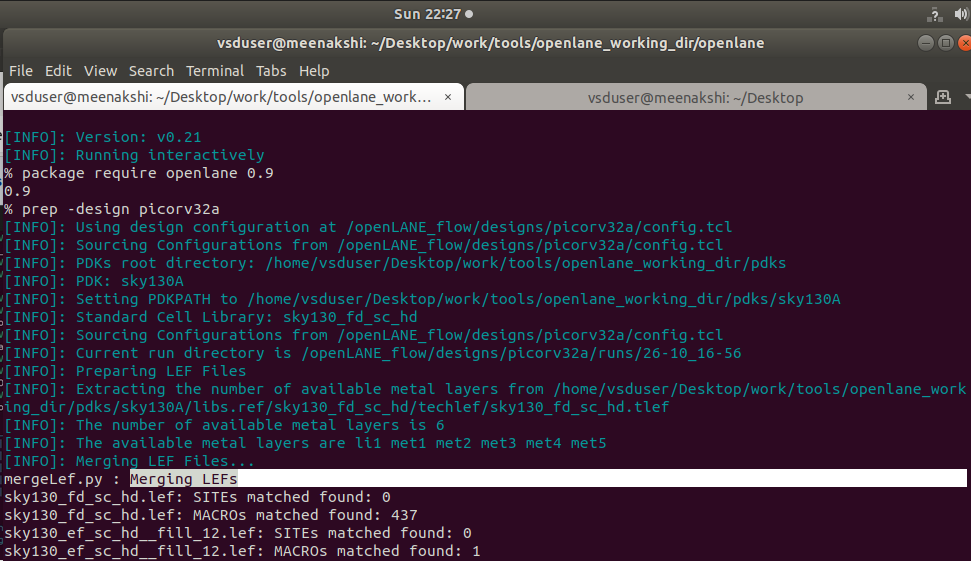
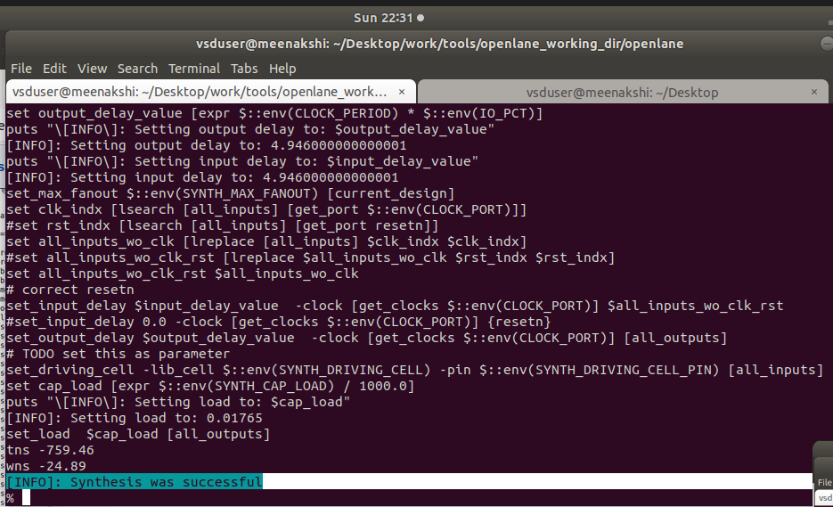
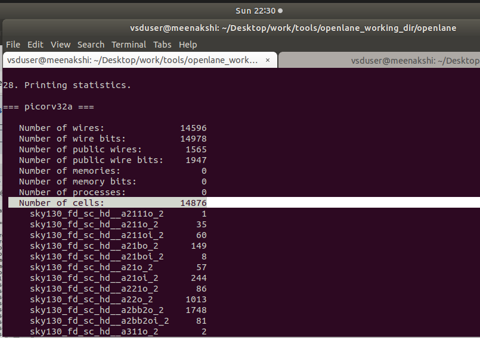
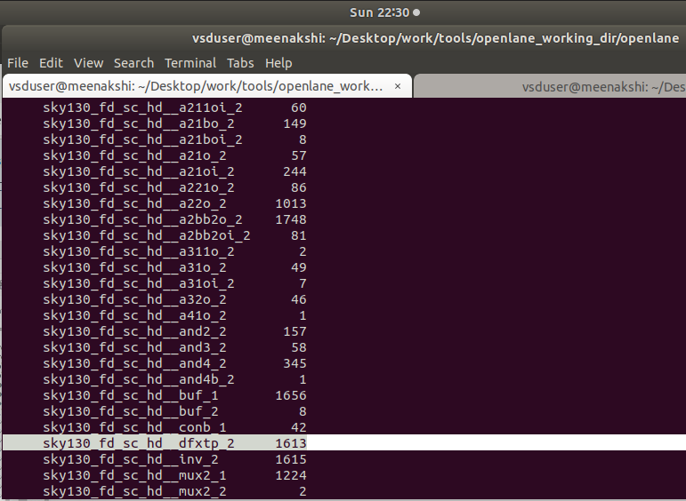

# Day-1 of Week-6 RISC-V Tapeout Program

<p align="center">
  
</p>

## Directory Structure

<p align="center">
  
  <br>
  <em>Analysing Openlane Structure</em>
</p>
If you like to view the directory structure → [Click here](https://github.com/Meenakshi-2627/Week-6_RISC-V_Tapeout_Program/blob/main/Day-1/Files/Directory_Structure.txt)


---

## Setting up and Synthesis

### 1. Setting PDK Root Path
```bash
export PDK_ROOT=/home/vsduser/Desktop/work/tools/openlane_working_dir/pdks
```

**Explanation:** Sets the environment variable `PDK_ROOT` pointing to the Process Design Kit directory containing all the technology files.

---

### 2. Navigate to OpenLane Directory
```bash
cd ~/Desktop/work/tools/openlane_working_dir/openlane
```

**Explanation:** Changes the current working directory to the OpenLane installation folder.

---

### 3. Docker Alias Setup
```bash
alias docker='docker run -it -v $(pwd):/openLANE_flow -v $PDK_ROOT:$PDK_ROOT -e PDK_ROOT=$PDK_ROOT -u $(id -u $USER):$(id -g $USER) efabless/openlane:v0.21'
```

**Explanation:** Creates a shortcut command that runs OpenLane inside a Docker container with mounted volumes and user permissions.

---

### 4. Navigate to Designs Folder
```bash
cd designs
```

**Explanation:** Moves into the designs directory where all ASIC design projects are stored.

---

### 5. Launch Docker Container
```bash
docker
```

**Explanation:** Executes the Docker container using the alias created, launching the OpenLane environment.

<p align="center">
  
</p>

### 6. Load OpenLane Package
```tcl
% package require openlane 0.9
```

**Explanation:** Loads the OpenLane tool package version 0.9 in the Tcl interactive shell.

---

### 7. Prepare Design
```tcl
% prep -design picorv32a
```

**Explanation:** Prepares the design environment for `picorv32a` processor, setting up necessary files and configurations.

---

<p align="center">
  
</p>

### 8. Run Synthesis
```tcl
% run_synthesis
```
<p align="center">
  
</p>

**Explanation:** Executes the logic synthesis step, converting RTL code to gate-level netlist using the specified technology library.

---

# Task: Calculation of Flop Ratio and DFF %

## Objective
To evaluate the sequential logic content in the synthesized design.

---

## Given Data

| Parameter | Value |
|-----------|-------|
| **Total Cells** | 15134 |
| **DFF Cells** | 1613 (from `sky130_fd_sc_hd__dfxtp_2`) |

---

## Screenshots from Synthesis Report

### Total Cells Count
<p align="center">
  
</p>

### DFF Cells Count
<p align="center">
  
</p>

---

## Calculations

### ➤ Flop Ratio

```
Flop Ratio = DFFs / Total Cells
           = 1613 / 15134
           ≈ 0.1065
```

---

### ➤ DFF Percentage

```
DFF % = (DFFs / Total Cells) × 100
      = (1613 / 15134) × 100
      ≈ 10.65%
```

---

## Result

- **Flop Ratio:** `0.1065`
- **DFF Percentage:** `10.65%`

This indicates that approximately **10.65%** of the total cells in the design are flip-flops, representing the sequential logic component of the synthesized `picorv32a` design.

---
