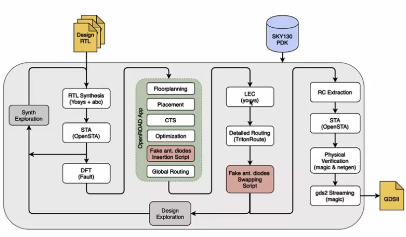

# Day-1 of Week-6 RISC-V Tapeout Program

<p align="center">
  
</p>

---
## Table of Contents 
- [Theory](#theory)
- [Lab](#lab)
- [Task](#task-calculation-of-flop-ratio-and-dff-)
---
## Theory

  - [Introduction to QFN-48 Package, Chip, Pads, Core, Die and IPs](#introduction-to-qfn-48-package-chip-pads-core-die-and-ips)
  - [Introduction to RISC-V](#introduction-to-risc-v)
  - [Simplified RTL2GDS Flow](#simplified-rtl2gds-flow)
  - [OpenLANE Detailed ASIC Design Flow](#introduction-to-openlane-detailed-asic-design-flow)


**Introduction to QFN-48 Package, Chip, Pads, Core, Die and IPs** :

A **package** is the protective enclosure that houses the actual semiconductor chip. The QFN-48 (Quad Flat No-leads) package is a commonly used surface-mount package with 48 connection pins. Inside this package lies the actual silicon chip, connected to the package pins through **wire bonding**.

**Key Components:**

- **Pads:** The interface points where external signals enter or exit the chip. They are located at the periphery of the die.
- **Core:** The central area of the chip where all the digital logic, memory, and computational blocks are placed.
- **Die:** The entire piece of silicon that contains the integrated circuit. It is cut from a silicon wafer during manufacturing.
- **IPs (Intellectual Properties):** Pre-designed and verified functional blocks such as memory controllers, communication interfaces, or processors that can be integrated into the chip design.

The die is manufactured at a **foundry**, and foundry-specific design rules and libraries are provided through the **Process Design Kit (PDK)**.

---

#### Introduction to RISC-V

<p align="center">
  
</p>

**RISC-V** is an open-source Instruction Set Architecture (ISA) based on Reduced Instruction Set Computing (RISC) principles. Unlike proprietary ISAs, RISC-V is freely available for anyone to use, modify, and implement.

**Key Features:**
- Open standard ISA with no licensing fees
- Modular and extensible architecture
- Suitable for a wide range of applications from embedded systems to high-performance computing
- Growing ecosystem of tools, software, and hardware implementations

RISC-V acts as the **bridge between software and hardware**, defining how software instructions are executed by the processor hardware.

---

#### From Software Applications to Hardware

<p align="center">
  
</p>

The execution of software applications on hardware involves multiple abstraction layers:

**1. Application Software:** Programs written in high-level languages (C, C++, Python, Java) that perform specific tasks.

**2. System Software:** This layer includes:
   - **Operating System (OS):** Manages hardware resources, I/O operations, memory allocation, and provides low-level system functions.
   - **Compiler:** Translates high-level code into architecture-specific instructions. The output depends on the target hardware's ISA (e.g., RISC-V, x86, ARM).
   - **Assembler:** Converts assembly language instructions into binary machine code (0s and 1s).

**3. Hardware:** The physical processor that executes the binary instructions. The hardware is implemented using RTL (Register Transfer Level) descriptions that define the digital logic circuits.

**Flow Summary:**
```
Application → OS → Compiler → Assembler → Binary → Hardware (RTL → Netlist → Layout)
```

---

### SoC Design and OpenLANE

#### Introduction to All Components of Open-Source Digital ASIC Design

For successful open-source ASIC design implementation, three key elements are essential:

**1. RTL Designs:** Hardware description of the circuit using languages like Verilog or VHDL. Open-source RTL designs are available from repositories like LibreCores, OpenCores, and GitHub.

**2. EDA Tools:** Electronic Design Automation tools that automate the design process from RTL to GDSII. Examples include:
   - Synthesis: Yosys
   - Placement & Routing: OpenROAD
   - Layout: Magic, KLayout
   - Timing Analysis: OpenSTA

**3. PDK (Process Design Kit):** A collection of files provided by the foundry that contains:
   - Device models
   - Technology files
   - Design rules (DRC/LVS)
   - Standard cell libraries
   - I/O libraries

The **SkyWater 130nm PDK** was the first open-source PDK released in collaboration with Google, making it possible to design and fabricate chips using completely open-source tools and processes.

---

#### Simplified RTL2GDS Flow

<p align="center">
  
</p>

The ASIC design flow converts Register Transfer Level (RTL) code into a fabrication-ready GDSII layout file through the following stages:

**1. Synthesis:**
   - RTL code is converted into a gate-level netlist
   - Uses standard cells from the PDK library
   - Optimizes for area, power, and timing

**2. Floor Planning and Power Planning:**
   - Defines the die area and aspect ratio
   - Places I/O pads around the periphery
   - Creates power distribution network (VDD/VSS rings, straps, and rails)

**3. Placement:**
   - **Global Placement:** Finds approximate locations for all cells
   - **Detailed Placement:** Legalizes cell positions to remove overlaps and align to placement sites

**4. Clock Tree Synthesis (CTS):**
   - Builds a clock distribution network
   - Minimizes clock skew and insertion delay
   - Uses clock buffers and inverters

**5. Routing:**
   - **Global Routing:** Creates routing guides for interconnects
   - **Detailed Routing:** Implements actual metal connections following design rules

**6. Sign-Off:**
   - **Physical Verification:** DRC (Design Rule Check) and LVS (Layout vs Schematic)
   - **Timing Verification:** STA (Static Timing Analysis) to ensure timing constraints are met

**7. GDSII Generation:**
   - Final layout is streamed out in GDSII format for fabrication

---

#### Introduction to OpenLANE and Strive Chipsets

**OpenLANE** is an automated RTL to GDSII flow developed by eFabless as part of the OpenROAD project. It was designed to produce clean GDSII layouts without human intervention.

**Key Features:**
- Fully automated flow from RTL to GDSII
- Tuned for the SkyWater 130nm open-source PDK
- Supports design space exploration
- Includes built-in design for test (DFT) insertion
- Large number of design examples and reference flows

**Strive Chipsets:**
The Strive family is a series of open-source System-on-Chip (SoC) designs created using OpenLANE:
- **striVe:** Basic SoC with RISC-V core
- **striVe 2, 3, 4, 5, 6:** Progressive enhancements with additional features and complexity

These chipsets demonstrate the capability of open-source tools to create manufacturable silicon.

---

#### Introduction to OpenLANE Detailed ASIC Design Flow

<p align="center">
  
</p>

<p align="center">
  
</p>

OpenLANE integrates multiple open-source tools into a cohesive automated flow:

**RTL Synthesis:**
- **Yosys:** Performs RTL synthesis and converts HDL to gate-level netlist
- **ABC:** Technology mapping to standard cells from the PDK

**Design Exploration:**
- Generates multiple design configurations
- Analyzes trade-offs between area, timing, and power

**Design For Test (DFT):**
- **Fault:** Performs scan insertion, ATPG (Automatic Test Pattern Generation), and test coverage analysis

**Physical Implementation (OpenROAD App):**
- **Floor/Power Planning:** Defines chip dimensions and power grid
- **Placement:** Global and detailed placement of standard cells
- **CTS:** Clock tree synthesis to distribute clock signals
- **Optimization:** Timing and power optimization
- **Global Routing:** High-level routing planning
- **Detailed Routing:** Actual metal layer connections using **TritonRoute**

**Logic Equivalence Check (LEC):**
- Verifies that the netlist after physical implementation is functionally equivalent to the original RTL

**RC Extraction:**
- Extracts parasitic resistances and capacitances from the layout

**Static Timing Analysis (STA):**
- **OpenSTA:** Verifies timing constraints are met across all corners

**Physical Verification:**
- **Magic:** Performs DRC checks and generates GDSII
- **Netgen:** Performs LVS checks to ensure layout matches schematic

**GDSII Streaming:**
- Final layout is generated in GDSII format ready for fabrication

--- 

## Lab

  - [Environment Setup Guide](#environment-setup-guide)
  - [Directory Structure](#directory-structure)
  - [Synthesis Process](#setting-up-and-synthesis)
<details>
<summary><strong>📘 Environment Setup Guide (Click to Expand)</strong></summary>

---

# Environment Setup Guide

## Overview

This guide will walk you through setting up the OpenLANE environment for the RISC-V Tapeout Program using Oracle VirtualBox.

---

## Method 1: Using Pre-configured VDI File (Recommended)

### Step 1: Download Required Files

Download the OpenLANE VDI file from the link below:

https://vsd-labs.sgp1.cdn.digitaloceanspaces.com/vsd-labs/openlane.zip

sql
Copy code

### Step 2: Extract the Downloaded File

Unzip the downloaded `openlane.zip` file to extract the `.vdi` (Virtual Disk Image) file.

### Step 3: Create New Virtual Machine in Oracle VirtualBox

1. Open **Oracle VirtualBox**
2. Click on **"New"** to create a new virtual machine
3. Configure the following settings:
   - **Name:** OpenLANE_Environment (or any preferred name)
   - **RAM:** Allocate minimum 4GB (4096 MB) or more based on your system capacity
   - **CPU Cores:** Allocate 2 or more cores for better performance
   - **Storage:** Skip creating a new virtual hard disk for now

4. Click **"Finish"** to complete the initial setup

### Step 4: Attach the OpenLANE VDI File

1. Select the newly created virtual machine
2. Go to **Settings → Storage**
3. Under **Storage Devices**, locate **Controller: IDE**
4. Click on **"Empty"** under Controller: IDE
5. On the right side, click the **disk icon** next to "Optical Drive"
6. Choose **"Choose/Create a Virtual Hard Disk"**
7. Click **"Add"** and browse to select the extracted `openlane.vdi` file
8. Select the `openlane.vdi` file and click **"Choose"**
9. Click **"OK"** to save the settings

### Step 5: Start the Virtual Machine

1. Select the virtual machine from the VirtualBox manager
2. Click **"Start"** to boot the environment
3. The OpenLANE environment will be ready to use with all pre-installed tools

---

## Method 2: Building from Source (Alternative Method)

This method involves cloning the necessary repositories and building the PDKs from source.

### Step 1: Clone the Required Repository

To get started, clone the required files and project setup from the GitHub repository:

```bash
git clone https://github.com/fayizferosh/soc-design-and-planning-nasscom-vsd
```
This repository contains all the necessary resources, scripts, and design files to follow along with the OpenLANE-based Advanced Physical Design flow, including the picorv32a case study.

Step 2: Building PDKs from Source
To build and install the OpenPDKs (Process Design Kits) for the Sky130 process node, follow these steps:

```bash
git clone https://github.com/RTimothyEdwards/open_pdks.git  
cd open_pdks  
./configure --enable-sky130-pdk  
make  
sudo make install
```
>❗ Note: Before building open_pdks, please ensure you have Magic 8.3.530 or later installed and available in your path, as earlier versions may lack the required CIF interfaces.

**Verification**  :  
Once the environment is set up, verify the installation by checking:

- OpenLANE installation directory

- PDK files in the designated path

- All required tools are accessible from terminal

**Troubleshooting**
- If the virtual machine fails to boot, ensure virtualization is enabled in your BIOS settings

- If storage issues occur, verify sufficient disk space is allocated

For build errors in Method 2, ensure all dependencies are installed

 </details> 

---

## Directory Structure

<p align="center">
  
  <br>
  <em>Analysing Openlane Structure</em>
</p>
If you like to view the directory structure :
<p>
  <a href="https://github.com/Meenakshi-2627/Week-6_RISC-V_Tapeout_Program/blob/main/Day-1/Files/Directory_Structure.txt">click here</a>
</p>

---


## Setting up and Synthesis

### 1. Setting PDK Root Path
```bash
export PDK_ROOT=/home/vsduser/Desktop/work/tools/openlane_working_dir/pdks
```

**Explanation:** Sets the environment variable `PDK_ROOT` pointing to the Process Design Kit directory containing all the technology files.

---

### 2. Navigate to OpenLane Directory
```bash
cd ~/Desktop/work/tools/openlane_working_dir/openlane
```

**Explanation:** Changes the current working directory to the OpenLane installation folder.

---

### 3. Docker Alias Setup
```bash
alias docker='docker run -it -v $(pwd):/openLANE_flow -v $PDK_ROOT:$PDK_ROOT -e PDK_ROOT=$PDK_ROOT -u $(id -u $USER):$(id -g $USER) efabless/openlane:v0.21'
```

**Explanation:** Creates a shortcut command that runs OpenLane inside a Docker container with mounted volumes and user permissions.

---

### 4. Navigate to Designs Folder
```bash
cd designs
```

**Explanation:** Moves into the designs directory where all ASIC design projects are stored.

---

### 5. Launch Docker Container
```bash
docker
```

**Explanation:** Executes the Docker container using the alias created, launching the OpenLane environment.

<p align="center">
  
</p>

### 6. Load OpenLane Package
```tcl
% package require openlane 0.9
```

**Explanation:** Loads the OpenLane tool package version 0.9 in the Tcl interactive shell.

---

### 7. Prepare Design
```tcl
% prep -design picorv32a
```

**Explanation:** Prepares the design environment for `picorv32a` processor, setting up necessary files and configurations.

---

<p align="center">
  
</p>

### 8. Run Synthesis
```tcl
% run_synthesis
```
<p align="center">
  
</p>

**Explanation:** Executes the logic synthesis step, converting RTL code to gate-level netlist using the specified technology library.

---

# Task: Calculation of Flop Ratio and DFF %

## Objective
To evaluate the sequential logic content in the synthesized design.

---

## Given Data

| Parameter | Value |
|-----------|-------|
| **Total Cells** | 15134 |
| **DFF Cells** | 1613 (from `sky130_fd_sc_hd__dfxtp_2`) |

---

## Screenshots from Synthesis Report

### Total Cells Count
<p align="center">
  
</p>

### DFF Cells Count
<p align="center">
  
</p>

---

## Calculations

### ➤ Flop Ratio

```
Flop Ratio = DFFs / Total Cells
           = 1613 / 15134
           ≈ 0.1065
```

---

### ➤ DFF Percentage

```
DFF % = (DFFs / Total Cells) × 100
      = (1613 / 15134) × 100
      ≈ 10.65%
```

---

## Result

- **Flop Ratio:** `0.1065`
- **DFF Percentage:** `10.65%`

This indicates that approximately **10.65%** of the total cells in the design are flip-flops, representing the sequential logic component of the synthesized `picorv32a` design.

---
