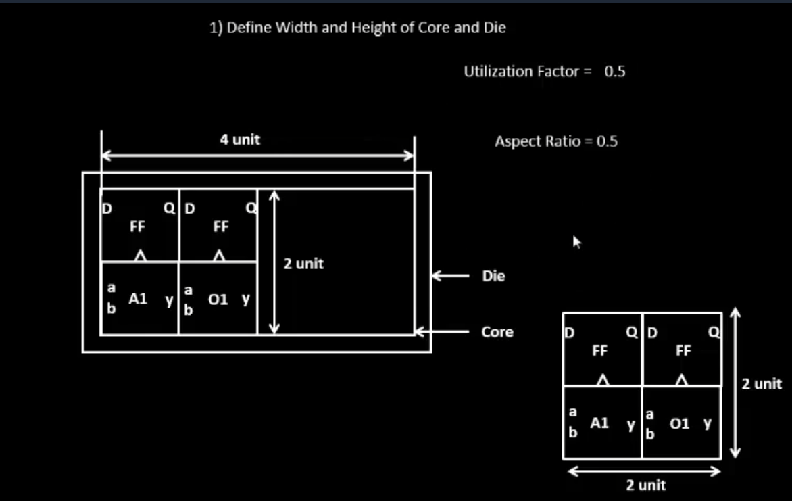

# Day 2: Good Floorplan vs Bad Floorplan and Introduction to Library Cells

## Table of Contents
- **Chip Floor Planning Considerations**
  - [ Utilization Factor and Aspect Ratio](#utilization-factor-and-aspect-ratio)
  - [ Concept of Pre-placed Cells](#concept-of-pre-placed-cells)
  - [ De-coupling Capacitors](#de-coupling-capacitors)
  - [ Power Planning](#power-planning)
  - [ Pin Placement and Logical Cell Placement Blockage](#pin-placement-and-logical-cell-placement-blockage)

---

## Chip Floor Planning Considerations

###  Utilization Factor and Aspect Ratio



Floor planning is the first crucial step in physical design, where we define the dimensions and layout of the chip. The fundamental concepts are:

#### **Core and Die**
- **Core**: The area where actual logic circuits and standard cells are placed
- **Die**: The entire silicon area including core, I/O pads, and peripherals

#### **Utilization Factor**
```
Utilization Factor = Area occupied by netlist / Total core area
```
- In the example: **Utilization Factor = 0.5** (50%)
- Indicates 50% of core is occupied by cells, 50% is available for routing
- A value of 1.0 means 100% utilization (impractical - no routing space)
- Typical range: **0.5 to 0.7** for good designs

#### **Aspect Ratio**
```
Aspect Ratio = Height / Width
```
- In the example: **Aspect Ratio = 0.5**
- Value of 1 → Square chip
- Value ≠ 1 → Rectangular chip

**Key Observations from the diagram:**
- Die dimensions: **4 units × 2 units**
- Core dimensions: **2 units × 2 units**
- Contains: Flip-flops (FF), AND gates (A1), OR gates (O1)
- Pins labeled: p, q, D, a, b, y

---

###  Concept of Pre-placed Cells


Pre-placed cells are critical functional blocks positioned manually before automated placement begins.

#### **What are Pre-placed Cells?**
Pre-placed cells include:
- 🔷 Memory blocks (SRAM, ROM, Register files)
- 🔷 Complex IP blocks (PLLs, ADCs, DACs)
- 🔷 Decoders (DEC_P1, DEC_P2, DEC_P3)
- 🔷 Clock gating cells
- 🔷 Analog macros

#### **Why Manual Placement?**
1. ✅ Fixed locations for optimal performance
2. ✅ Specific power/ground connection requirements
3. ✅ Strategic positioning for minimal interconnect delays
4. ✅ Hard macros with predefined dimensions
5. ✅ Reusable IP blocks treated as black boxes

#### **Three-Stage Process:**

**Stage 1: Define Locations**
- Identify critical functional blocks (Block 1, Block 2)
- Analyze logic gates (A1-A8) within blocks
- Identify critical signal paths (highlighted in yellow)

**Stage 2: Extend I/O Pins**
- Bring internal signals to block boundaries
- Create defined interfaces for connectivity
- Enable modular design approach

**Stage 3: Black Box Abstraction**
- Abstract internal complexity
- Show only input/output interfaces
- Automated tools treat them as fixed obstacles
- Cannot be moved during placement optimization

> 💡 **Note**: Yellow connections represent critical inter-block paths that influence placement decisions.

---

###  De-coupling Capacitors


De-coupling capacitors are essential for maintaining signal integrity and preventing noise-induced failures.

#### **Understanding Voltage Levels**

| Voltage Level | Description |
|--------------|-------------|
| **VOH** | Minimum voltage for logic '1' output |
| **VIH** | Minimum voltage recognized as logic '1' input |
| **VIL** | Maximum voltage recognized as logic '0' input |
| **VOL** | Maximum voltage for logic '0' output |

#### **Noise Margin Regions**

**NML (Noise Margin Low)**: VOL to VIL  
**NMH (Noise Margin High)**: VIH to VOH  
**Undefined Region**: VIL to VIH ⚠️ Danger zone!

#### **Three Critical Scenarios:**

1. **Scenario A**: Bump between VOL and VIH
   - ✅ Correctly interpreted as logic '0'
   - Safe operation

2. **Scenario B**: Bump between VIH and VOH
   - ❌ **UNDEFINED** logic state
   - May cause functional errors
   - Different gates may interpret differently

3. **Scenario C**: Bump between VOH and NMH
   - ✅ Correctly interpreted as logic '1'
   - Within acceptable margins

---


#### **The Ground Bounce Problem**

**What happens during simultaneous switching?**

Binary sequence: `0001101000111001`

When multiple outputs switch from '1' to '0':
1. ⚡ All charged capacitors discharge simultaneously
2. ⚡ Large current flows through single ground tap
3. ⚡ Ground path inductance/resistance causes voltage drop
4. ⚡ Ground voltage temporarily rises (bounce)
5. ⚡ Reduces noise margin for logic '0'

**Consequences:**
- ❌ False switching
- ❌ Metastability issues
- ❌ Noise injection into neighboring circuits
- ❌ Reduced reliability

#### **Solution: De-coupling Capacitors**

De-coupling capacitors (decaps) provide:
- ✅ Local charge reservoir near circuits
- ✅ Instantaneous current during switching
- ✅ Absorption of charge during transitions
- ✅ Reduced burden on power distribution network
- ✅ Smoothed voltage fluctuations
- ✅ Minimized ground bounce

> 💡 **Placement Strategy**: Place decaps as close as possible to logic blocks for maximum effectiveness.

---

###  Power Planning


Power planning creates a robust power distribution network (PDN) ensuring stable voltage delivery across the chip.

#### **Power Grid Structure**

**Color Coding:**
- 🔵 **Blue lines**: Power (VDD) and Ground (VSS) rails
- ⬛ **Black rectangles**: Standard cell rows / routing channels
- 🟡 **Yellow dots**: Via connections between metal layers
- ⬜ **Gray blocks**: Pre-placed cells (DEC_P1, DEC_P2, DEC_P3, Blocks a/b/c)

#### **PDN Hierarchy**

```
Power Pads → Power Rings → Power Straps → Power Rails → Standard Cells
```

| Level | Description | Metal Layer |
|-------|-------------|-------------|
| **Power Rings** | Thick metal around core periphery | Top metals |
| **Power Straps** | Vertical distribution across chip | Upper metals |
| **Power Rails** | Horizontal supply to cell rows | Lower metals |
| **Power Grid** | Mesh of intersecting power lines | Multiple layers |

#### **Benefits of Mesh Power Grid**

1. **Reduced IR Drop**
   - Multiple parallel paths → Lower resistance
   - Minimizes voltage drop across the chip

2. **Lower Impedance**
   - Grid structure provides low-impedance paths
   - Critical for high-frequency switching

3. **Redundancy**
   - Current flows through alternate paths
   - Improved reliability

4. **Reduced Electromigration**
   - Current distributed across multiple wires
   - Extends chip lifetime

5. **Better Noise Immunity**
   - Localized power grid minimizes bounce
   - Stable VDD and VSS

#### **Strategic Considerations**

- ⚡ Pre-placed blocks positioned near power straps
- ⚡ Balanced distribution prevents hot spots
- ⚡ Every cell has nearby, low-resistance power access
- ⚡ Multiple grid access points for redundancy

> 🎯 **Design Goal**: Ensure IR drop < 5% of VDD across the entire chip.

---

###  Pin Placement and Logical Cell Placement Blockage


The final floorplanning step involves strategic I/O pin placement and defining placement blockage regions.

#### **Pin Assignment**

**Left Side (Inputs)** ⬅️
```
Din1
Din4
CLK1
CLK2
Din2
Din3
```

**Right Side (Outputs)** ➡️
```
Dout1
Dout3
Clk Out
Dout2
Dout4
```

#### **Pin Placement Principles**

| Principle | Description | Benefit |
|-----------|-------------|---------|
| **Functional Grouping** | Related signals placed together | Organized routing |
| **Side Assignment** | Inputs on one side, outputs on opposite | Reduced congestion |
| **Clock Placement** | Strategic clock pin positioning | Minimized skew |
| **Proximity** | Pins near connected blocks | Shorter wire lengths |
| **Peripheral Location** | All I/O on die boundary | External connectivity |

#### **Core vs Die Boundary**

```
┌─────────────────────────────────┐
│          DIE AREA               │
│  ┌─────────────────────────┐   │
│  │     CORE AREA          │   │ ← I/O Pins here
│  │   (Logic Cells)        │   │
│  │   Pre-placed Blocks    │   │
│  └─────────────────────────┘   │
│    Placement Blockage Zone     │
└─────────────────────────────────┘
```

#### **Placement Blockage Zone**

The region between I/O pins and core boundary is **blocked** for:
- 🚫 Standard cell placement
- ✅ I/O cells and pad cells
- ✅ ESD protection circuits
- ✅ Level shifters
- ✅ I/O buffers

**Purpose:**
- Reserves space for I/O structures
- Prevents automated tools from placing logic cells in I/O region
- Maintains proper spacing between core and I/O
- Ensures signal integrity

#### **Design Considerations**

1. **Signal Integrity**
   - Input/output separation reduces crosstalk
   - Clean signal paths

2. **Power Distribution**
   - I/O cells connect to separate I/O power rings
   - Isolated from core power

3. **Package Constraints**
   - Pin placement aligns with package pinout
   - Bond pad locations

4. **Timing Optimization**
   - Critical paths influence pin placement
   - Reduced delay on timing-critical signals

5. **Connectivity**
   - Pins placed near related pre-placed blocks
   - Optimized for DEC_P1, DEC_P2, DEC_P3 connections

---

## Summary

A **good floorplan** requires careful consideration of:

✅ **Utilization Factor** (0.5-0.7) - Balance between area and routability  
✅ **Pre-placed Cells** - Strategic positioning of critical blocks  
✅ **De-coupling Capacitors** - Signal integrity and noise immunity  
✅ **Power Planning** - Robust mesh grid for stable power delivery  
✅ **Pin Placement** - Optimized I/O positioning with placement blockage  

> 🎯 **Result**: A well-planned floorplan that meets timing, power, and area requirements while ensuring manufacturability and reliability.

---

**Next Steps**: With a solid floorplan established, we proceed to placement and routing stages where the automated tools will work within these defined constraints to create the final chip layout.