# Day 2: Good Floorplan vs Bad Floorplan and Introduction to Library Cells

## Index
  - [Theory](#theory)

  - [Lab](#lab)


---
# Theory

## Table of Contents
- **Chip Floor Planning Considerations**
  - [Utilization Factor and Aspect Ratio](#utilization-factor-and-aspect-ratio)
  - [Concept of Pre-placed Cells](#concept-of-pre-placed-cells)
  - [De-coupling Capacitors](#de-coupling-capacitors)
  - [Power Planning](#power-planning)
  - [Pin Placement and Logical Cell Placement Blockage](#pin-placement-and-logical-cell-placement-blockage)
- **Library Binding and Placement**
  - [Netlist Binding and Initial Place Design](#netlist-binding-and-initial-place-design)
  - [Optimize Placement Using Estimated Wire-length and Capacitance](#optimize-placement-using-estimated-wire-length-and-capacitance)
  - [Final Placement Optimization](#final-placement-optimization)
  - [Need for Libraries and Characterization](#need-for-libraries-and-characterization)
- **Cell Design and Characterization Flows**
  - [Inputs for Cell Design Flow](#inputs-for-cell-design-flow)
  - [Circuit Design Step](#circuit-design-step)
  - [Layout Design Step](#layout-design-step)
  - [Typical Characterization Flow](#typical-characterization-flow)
- **General Timing Characterization Parameters**
  - [Timing Threshold Definitions](#timing-threshold-definitions)
  - [Propagation Delay and Transition Time](#propagation-delay-and-transition-time) 

---

## Chip Floor Planning Considerations

### Utilization Factor and Aspect Ratio

Floor planning is the first crucial step in physical design, where we define the dimensions and layout of the chip. The fundamental concepts are:

#### **Core and Die**
- **Core**: The area where actual logic circuits and standard cells are placed
- **Die**: The entire silicon area including core, I/O pads, and peripherals

#### **Utilization Factor**
```
Utilization Factor = Area occupied by netlist / Total core area
```
- In the example: **Utilization Factor = 0.5** (50%)
- Indicates 50% of core is occupied by cells, 50% is available for routing
- A value of 1.0 means 100% utilization (impractical - no routing space)
- Typical range: **0.5 to 0.7** for good designs

#### **Aspect Ratio**
```
Aspect Ratio = Height / Width
```
- In the example: **Aspect Ratio = 0.5**
- Value of 1 → Square chip
- Value ≠ 1 → Rectangular chip

---

### Concept of Pre-placed Cells

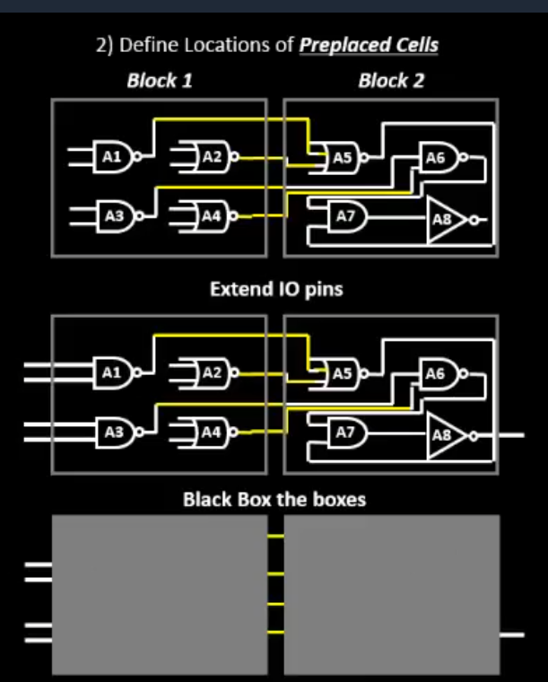

Pre-placed cells are critical functional blocks positioned manually before automated placement begins.

#### **What are Pre-placed Cells?**
Pre-placed cells include:
- 🔷 Memory blocks (SRAM, ROM, Register files)
- 🔷 Complex IP blocks (PLLs, ADCs, DACs)
- 🔷 Decoders (DEC_P1, DEC_P2, DEC_P3)
- 🔷 Clock gating cells
- 🔷 Analog macros

#### **Why Manual Placement?**
1. ✅ Fixed locations for optimal performance
2. ✅ Specific power/ground connection requirements
3. ✅ Strategic positioning for minimal interconnect delays
4. ✅ Hard macros with predefined dimensions
5. ✅ Reusable IP blocks treated as black boxes

---

### De-coupling Capacitors

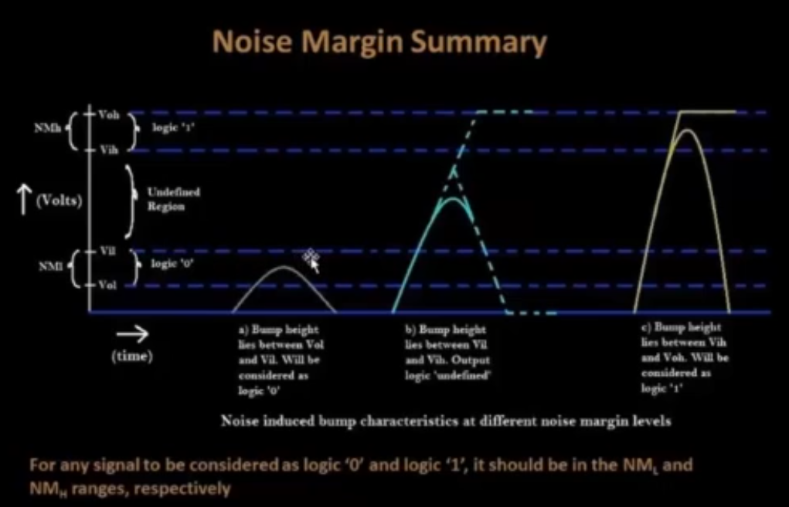

De-coupling capacitors are essential for maintaining signal integrity and preventing noise-induced failures.

#### **Understanding Voltage Levels**

| Voltage Level | Description |
|--------------|-------------|
| **VOH** | Minimum voltage for logic '1' output |
| **VIH** | Minimum voltage recognized as logic '1' input |
| **VIL** | Maximum voltage recognized as logic '0' input |
| **VOL** | Maximum voltage for logic '0' output |

#### **Noise Margin Regions**

**NML (Noise Margin Low)**: VOL to VIL  
**NMH (Noise Margin High)**: VIH to VOH  
**Undefined Region**: VIL to VIH ⚠️ Danger zone!

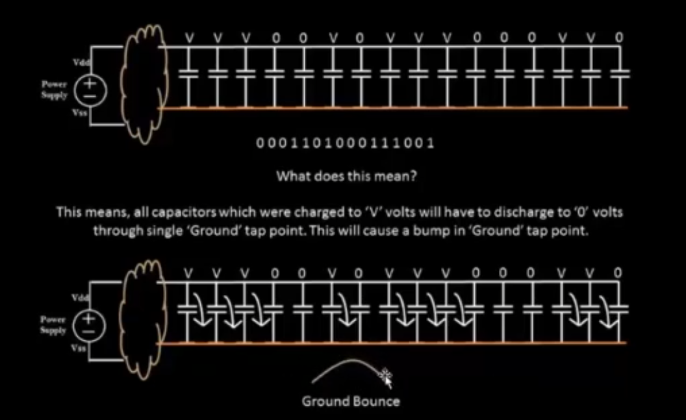

#### **Solution: De-coupling Capacitors**

De-coupling capacitors (decaps) provide:
- ✅ Local charge reservoir near circuits
- ✅ Instantaneous current during switching
- ✅ Absorption of charge during transitions
- ✅ Reduced burden on power distribution network
- ✅ Smoothed voltage fluctuations
- ✅ Minimized ground bounce

---

### Power Planning

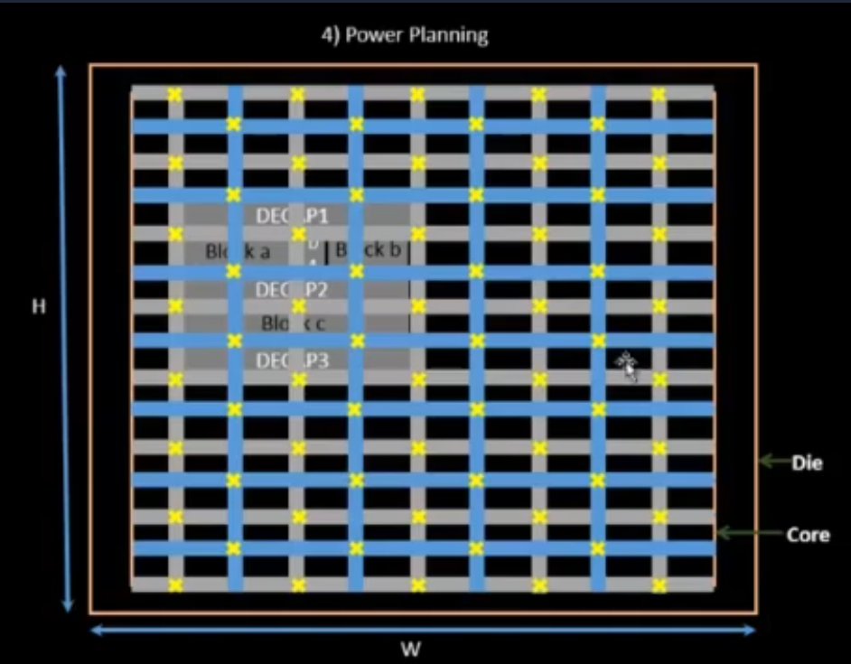

Power planning creates a robust power distribution network (PDN) ensuring stable voltage delivery across the chip.

#### **Power Grid Structure**

**Color Coding:**
- 🔵 **Blue lines**: Power (VDD) and Ground (VSS) rails
- ⬛ **Black rectangles**: Standard cell rows / routing channels
- 🟡 **Yellow dots**: Via connections between metal layers
- ⬜ **Gray blocks**: Pre-placed cells (DEC_P1, DEC_P2, DEC_P3, Blocks a/b/c)

---

### Pin Placement and Logical Cell Placement Blockage

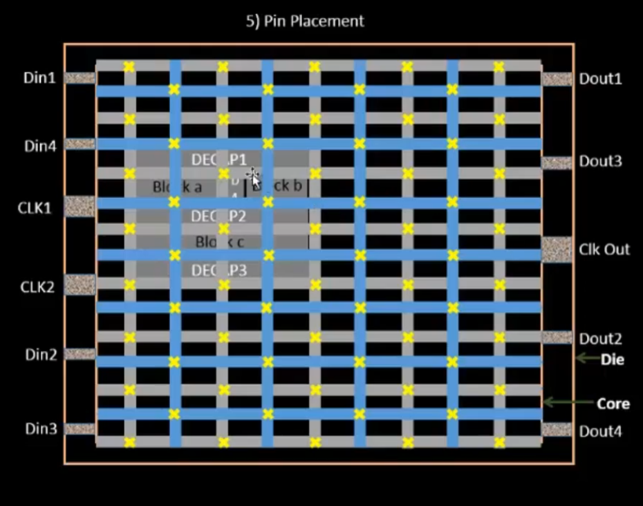

The final floorplanning step involves strategic I/O pin placement and defining placement blockage regions.

#### **Pin Assignment**

**Left Side (Inputs)** ⬅️
```
Din1
Din4
CLK1
CLK2
Din2
Din3
```

**Right Side (Outputs)** ➡️
```
Dout1
Dout3
Clk Out
Dout2
Dout4
```

---

## Library Binding and Placement

### Netlist Binding and Initial Place Design

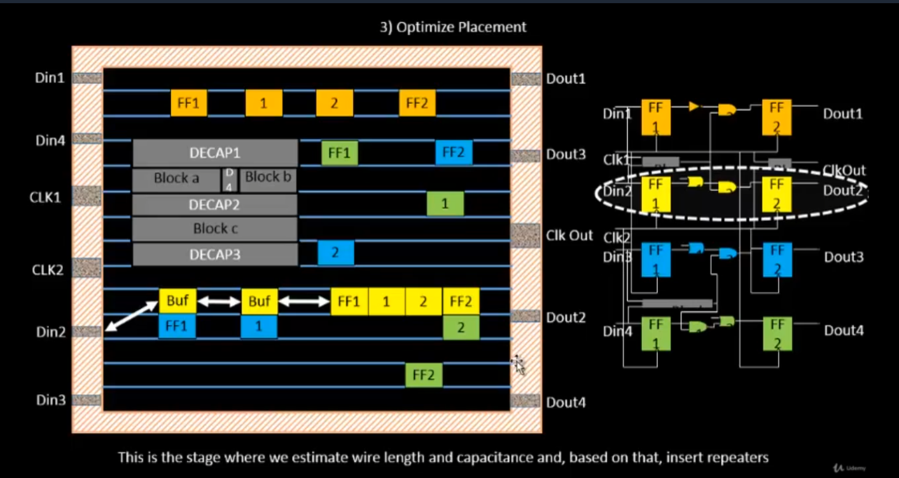

During placement, the logical netlist is bound to physical library cells from standard cell libraries.

#### **Standard Cell Library Components**

The library contains multiple implementations of each logic function:
- **Different sizes** (Size1, Size2, Size3) - offering different drive strengths
- **Different threshold voltages** (hVt, lVt) - trading off speed vs. power
- **Different functionalities** - AND, OR, BUFFER, INVERTER, DFF, LATCH, etc.

#### **Cell Selection Criteria**

Each cell in the library has:
- **Functionality**: AND gate, OR gate, FF1, FF2, Buffer, etc.
- **Drive strength**: Determined by transistor sizing
- **Timing characteristics**: Delay, setup/hold times
- **Power characteristics**: Static and dynamic power
- **Physical dimensions**: Width and height in the layout

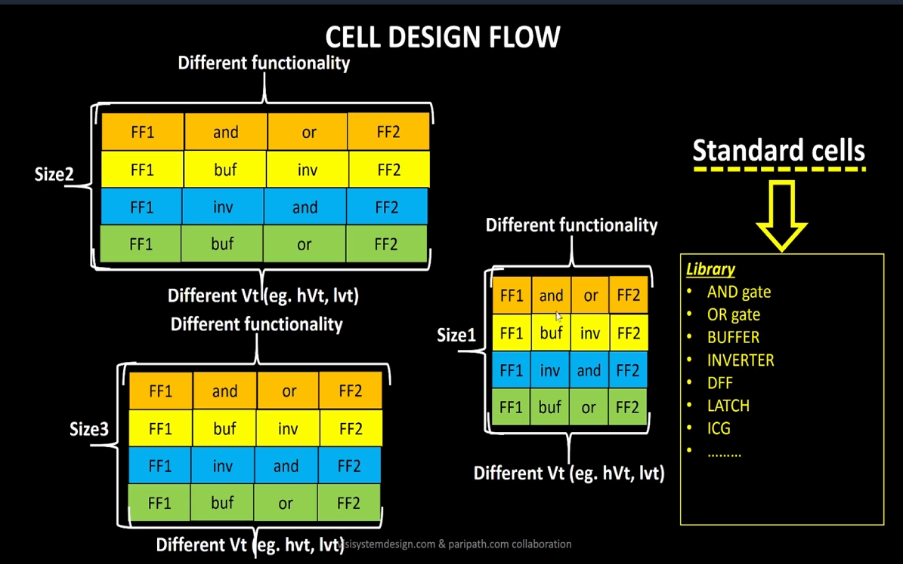

The netlist from logic synthesis shows the connectivity between cells, which must now be mapped to actual physical cells from the library and placed on the floorplan.

---

### Optimize Placement Using Estimated Wire-length and Capacitance

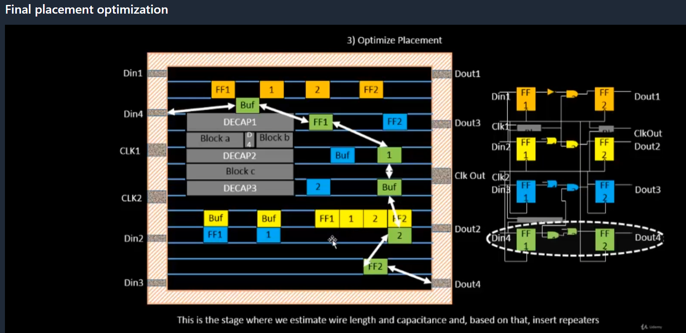

After initial placement, optimization focuses on reducing wire lengths and managing capacitance.

#### **Wire-length Estimation**

The placement tool estimates:
- **Manhattan distance** between connected cells
- **Net topology** (point-to-point vs. multi-pin nets)
- **Routing congestion** in different chip regions
- **Critical path delays** based on wire RC estimates

#### **Capacitance Considerations**

Wire capacitance affects:
- **Signal delay**: Longer wires → higher capacitance → slower transitions
- **Power consumption**: CV²f power increases with capacitance
- **Signal integrity**: High capacitance can cause noise issues

#### **Placement Optimization Techniques**

The tool performs iterative optimization by:
1. Placing cells close to minimize wire length on critical paths
2. Spreading cells to avoid routing congestion
3. Inserting buffers/repeaters for long interconnects
4. Re-sizing cells to balance drive strength with capacitive load
5. Considering timing constraints from synthesis

**Image 1** shows the floorplan with pre-placed cells (DECAP blocks) and the initial placement of logic cells. **Image 2** illustrates how buffers (Buf) are strategically inserted to drive long wires and maintain signal integrity.

---

### Final Placement Optimization


The final placement stage refines cell positions to meet all design constraints.

#### **Optimization Goals**

Final placement must satisfy:
- ✅ **Timing closure**: All setup and hold time constraints met
- ✅ **Routing feasibility**: No congestion hotspots
- ✅ **Power optimization**: Minimize dynamic and leakage power
- ✅ **Signal integrity**: Adequate spacing to prevent crosstalk
- ✅ **Design rules**: Satisfy all DRC requirements

#### **Buffer Insertion Strategy**

As shown in the image, buffers are inserted:
- On long nets to regenerate signals
- To balance fanout on high-fanout nets
- To fix timing violations
- To maintain signal integrity

The placement shows multiple buffer stages (Buf) connecting flip-flops (FF1, FF2) across different clock domains (Clk1, Clk2), demonstrating the complexity of optimized placement.

---

### Need for Libraries and Characterization

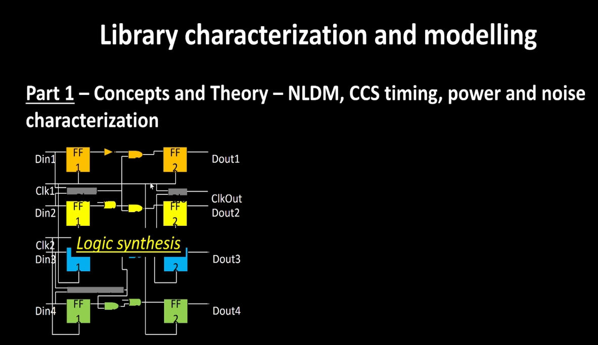

Standard cell libraries must be thoroughly characterized to enable accurate design implementation.

#### **Why Library Characterization is Critical**

Library characterization provides essential data for:

1. **Logic Synthesis**
   - Cell delay models
   - Area and power estimates
   - Drive strength information
   - Functionality definitions

2. **Timing Analysis**
   - Setup and hold times
   - Clock-to-Q delays
   - Propagation delays
   - Transition times

3. **Power Analysis**
   - Dynamic power per transition
   - Leakage power values
   - Internal power consumption

4. **Physical Design**
   - Cell dimensions
   - Pin locations
   - Routing resources

The image shows the flow where library cells are characterized and modeled to generate timing, noise, power libraries, and functional descriptions that feed into the synthesis process (Logic Synthesis in the image). The inputs include Process Design Kits (PDKs) with DRC & LVS rules, SPICE models, and user-defined specifications.

---

## Cell Design and Characterization Flows

### Inputs for Cell Design Flow

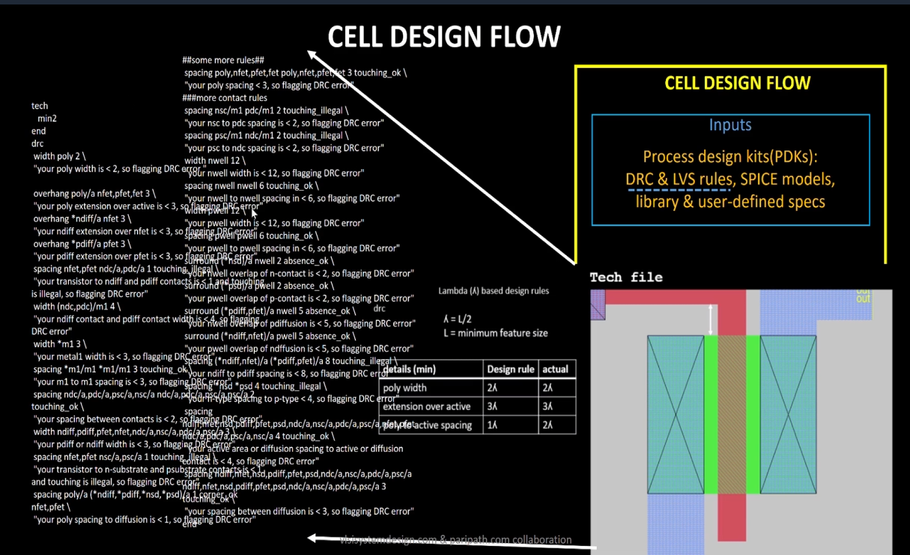

The cell design process requires multiple inputs from the Process Design Kit (PDK) and design specifications.

#### **Essential Inputs**

1. **Technology File (Tech File)**
   - Contains all design rules and constraints
   - Lambda-based or absolute dimension rules
   - Layer definitions and spacing requirements
   - Via and metal stack information

2. **DRC & LVS Rules**
   - Design Rule Check (DRC) constraints:
     - Minimum width, spacing, enclosure rules
     - Metal layer constraints
     - Via rules and restrictions
   - Layout vs. Schematic (LVS) rules:
     - Device matching criteria
     - Connectivity verification rules

3. **SPICE Models**
   - Transistor models for simulation
   - Process corner definitions (SS, FF, TT, SF, FS)
   - Temperature and voltage variations
   - Parasitic models

4. **Library & User-Defined Specs**
   - Cell height standards
   - Supply voltage levels
   - Drive strength requirements
   - Pin placement conventions
   - Timing targets

The image shows how these inputs flow into the Cell Design Flow, which uses DRC & LVS rules along with SPICE models to ensure the design meets all manufacturing and electrical requirements.

---

### Circuit Design Step


The circuit design step involves creating the transistor-level schematic and optimizing it for the target specifications.

#### **Circuit Design Activities**

1. **Transistor Sizing**
   - Determine W/L ratios for PMOS and NMOS devices
   - Balance pull-up and pull-down networks
   - Size for target drive strength and speed

2. **Circuit Topology Selection**
   - Choose appropriate logic implementation
   - Consider static CMOS, dynamic logic, or pass-gate logic
   - Optimize for area, speed, and power trade-offs

3. **Functionality Verification**
   - SPICE simulation across process corners
   - Verify correct logic operation
   - Check noise margins

4. **Performance Optimization**
   - Optimize for timing (propagation delay)
   - Minimize power consumption
   - Meet drive strength requirements

The image illustrates the cell design flow with inputs including library and user-defined specs, showing how the circuit design feeds into the overall characterization process.

---

### Layout Design Step

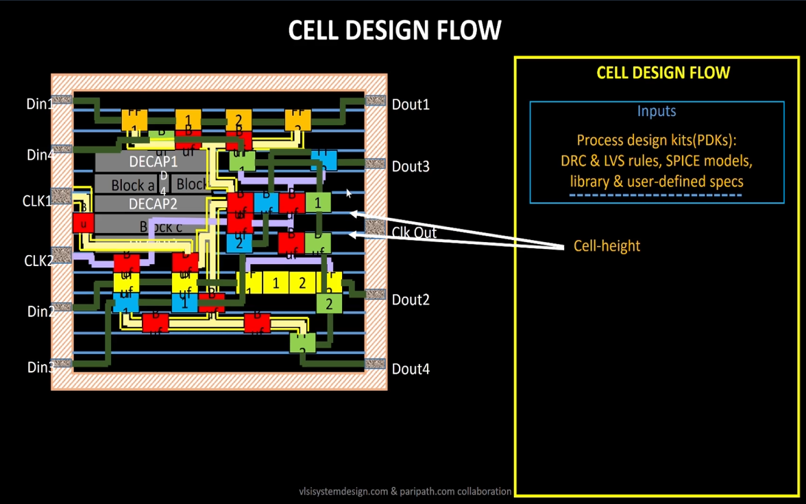
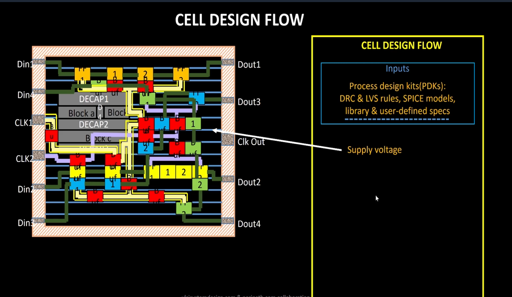
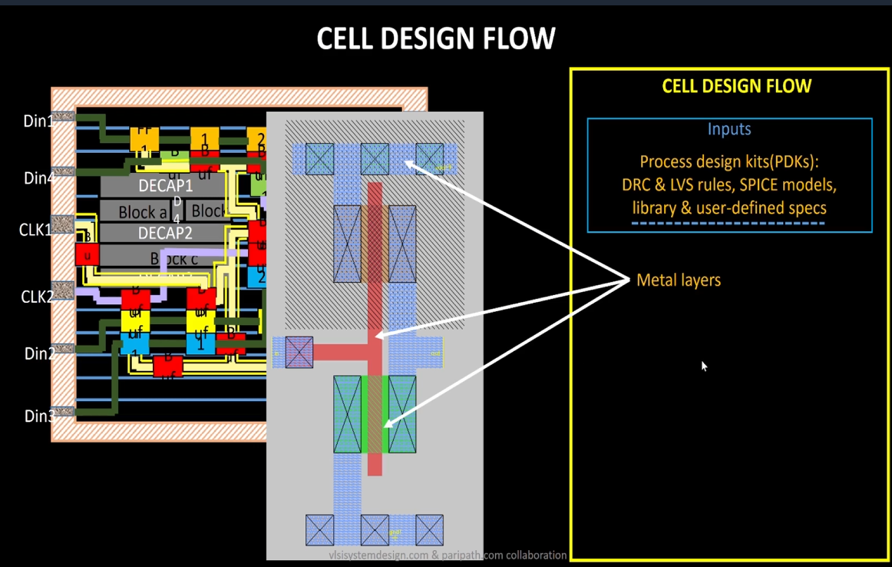

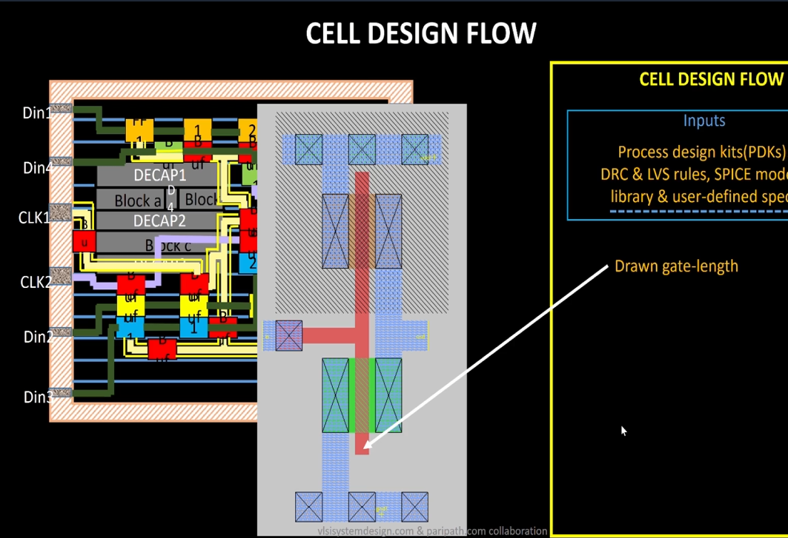

The layout design step translates the circuit schematic into a physical geometric representation following PDK rules.

#### **Layout Design Considerations**

**Cell Height Standardization** (Image 6)
- All cells in a library must have the same height
- Enables row-based placement
- Facilitates power rail alignment
- Typical heights: 6T, 9T, 12T (track heights)

**Supply Voltage Planning** (Image 7)
- VDD and GND rails run horizontally across cells
- Rails must align across all cells in a row
- Width determined by current requirements
- Adequate spacing to prevent shorts

**Metal Layer Assignment** (Image 8)
- Different metal layers for different purposes:
  - M1 (Metal 1): Local routing within cells
  - Higher metals: Inter-cell routing
- Via placement between layers
- Symmetry considerations for matched devices

**Pin Location Strategy** (Image 9)
- Pins placed on routing grid
- Accessibility from routing layers
- Consistent pin positions across library
- Consider pin access and congestion

**Drawn Gate Length** (Image 10)
- Physical gate length drawn in layout
- Accounts for process variations
- Affects transistor performance
- Must meet minimum spacing rules

#### **Layout Design Rules**

Key DRC rules to satisfy:
- Minimum width and spacing
- Enclosure rules for vias
- Metal density requirements
- Antenna rules
- Well spacing and isolation

---

### Typical Characterization Flow

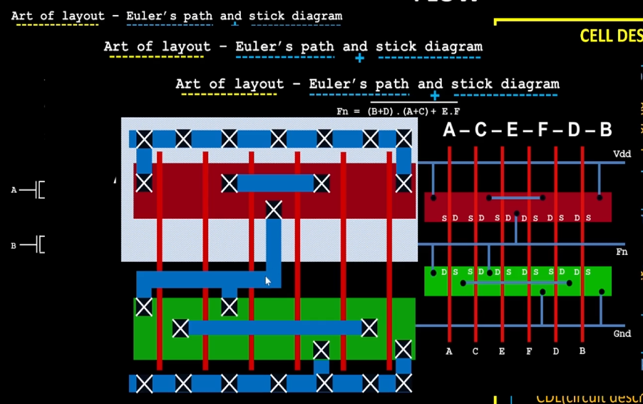

The characterization flow uses simulation tools to extract cell behavior across various conditions.

#### **Characterization Process**

1. **Extract Parasitics**
   - RC extraction from layout
   - Include wire resistance and capacitance
   - Model interconnect effects

2. **SPICE Simulation**
   - Simulate cell across process corners
   - Sweep input slew rates
   - Vary output load capacitances
   - Test different voltage and temperature conditions

3. **Generate Timing Models**
   - Calculate propagation delays
   - Determine transition times
   - Extract setup and hold times
   - Generate timing tables (Liberty format)

4. **Power Characterization**
   - Measure dynamic power per transition
   - Calculate leakage power
   - Determine internal power

5. **Create Library Files**
   - Liberty (.lib) files for timing
   - Layout Exchange Format (LEF) for physical data
   - SPICE models for detailed analysis

The **Euler's Path** diagram (Image 11) shows the stick diagram representation of a CMOS circuit, illustrating how to minimize the number of diffusion breaks in the layout by finding an optimal ordering of transistors. This optimization technique reduces area and improves performance by creating a continuous diffusion path.

---

## General Timing Characterization Parameters

### Timing Threshold Definitions

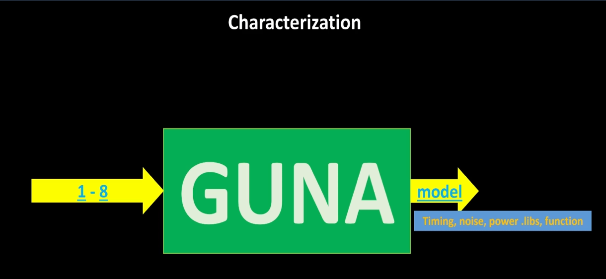
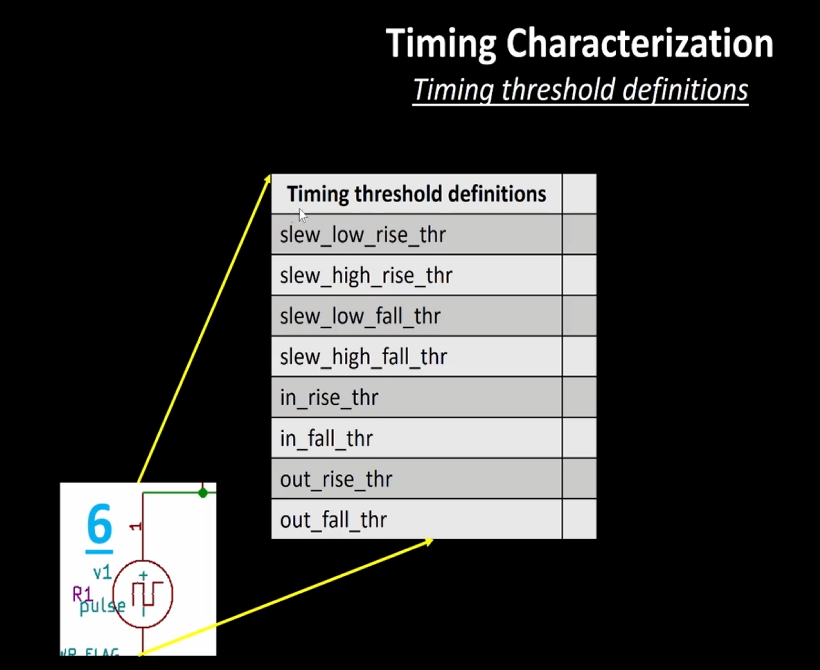

Timing characterization requires precise definitions of voltage thresholds for measuring delays.

#### **Standard Threshold Definitions**

The timing characterization table shows eight critical threshold parameters:

| Threshold Parameter | Definition | Typical Value |
|-------------------|------------|---------------|
| **slew_low_rise_thr** | Low threshold for rise slew measurement | 20% |
| **slew_high_rise_thr** | High threshold for rise slew measurement | 80% |
| **slew_low_fall_thr** | Low threshold for fall slew measurement | 20% |
| **slew_high_fall_thr** | High threshold for fall slew measurement | 80% |
| **in_rise_thr** | Input threshold for rise delay | 50% |
| **in_fall_thr** | Input threshold for fall delay | 50% |
| **out_rise_thr** | Output threshold for rise delay | 50% |
| **out_fall_thr** | Output threshold for fall delay | 50% |

#### **GUNA Characterization Tool**

The **GUNA** tool (Graphic User Network Analyzer) shown in Image 12 performs:
- Automated characterization of 1-8 cells simultaneously
- Generation of timing, noise, and power models
- Creation of Liberty format libraries (.libs)
- Functional verification

**Characterization Flow:**
```
Steps 1-8 → GUNA → Model Output
                    ├── Timing models
                    ├── Noise models
                    ├── Power models
                    └── Function definitions
```

---

### Propagation Delay and Transition Time

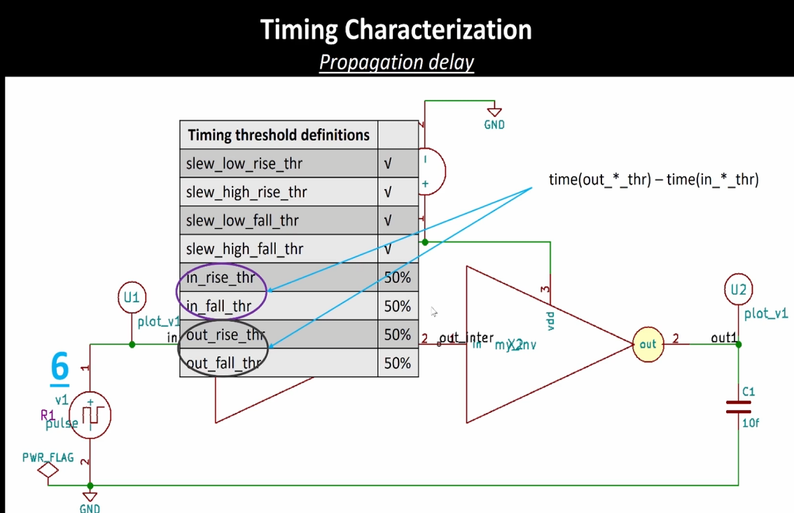
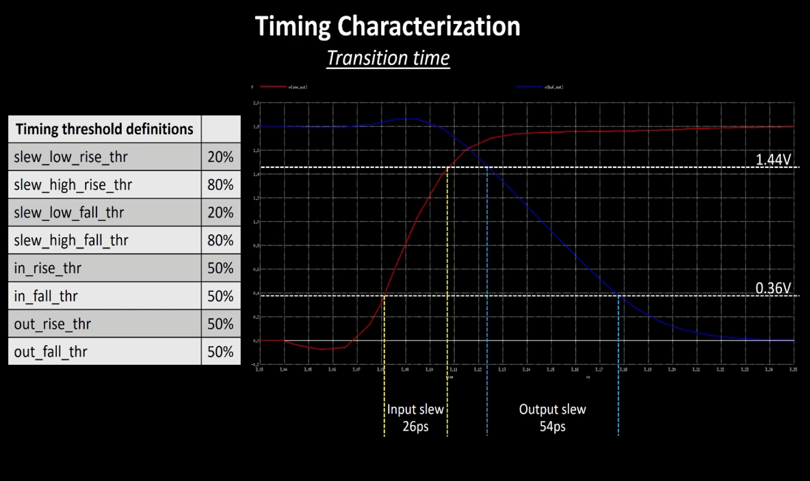

Accurate timing characterization requires precise measurement of propagation delay and transition times.

#### **Propagation Delay**

**Definition:**
```
Propagation Delay = time(out_*_thr) - time(in_*_thr)
```

**Image 14 Analysis:**
The image shows an inverter circuit with pulse input and includes:
- **Timing threshold table** showing 50% measurement points
- **Input-output relationship** displaying propagation delay
- **Measurement methodology**: Time difference between input crossing threshold and output crossing threshold

The circuit demonstrates:
- Input signal: V1 with PWR_FLAG and GND reference
- Inverter: U1 with mX2anv (2× drive strength)
- Output load: C1 (10f capacitance)
- Measurement points at 50% of supply voltage

#### **Transition Time (Slew)**

**Definition:**
```
Rise Transition Time = time(slew_high_rise_thr) - time(slew_low_rise_thr)
Fall Transition Time = time(slew_high_fall_thr) - time(slew_low_fall_thr)
```

**Image 15 Analysis:**
The waveform diagram illustrates:
- **Red trace** (v(out_a1)): Output voltage rising from 0 to 1.44V
- **Blue trace** (v(out_a1)): Output voltage falling from 1.44V to 0.36V
- **Input slew**: 26ps (measured between 20% and 80% thresholds)
- **Output slew**: 54ps (measured between 20% and 80% thresholds)

**Key Observations:**
- Voltage levels: 1.44V (logic high), 0.36V (logic low)
- Thresholds marked at specific voltage levels
- Time axis shows propagation through the circuit
- Asymmetric rise and fall times indicate different pull-up/pull-down strengths

#### **Importance of Accurate Timing**

Proper characterization of these parameters enables:
- ✅ Accurate static timing analysis (STA)
- ✅ Setup and hold time verification
- ✅ Clock skew analysis
- ✅ Signal integrity assessment
- ✅ Design optimization for timing closure

---

## Summary

This comprehensive guide covers:

✅ **Floorplanning Fundamentals** - Utilization factor, aspect ratio, pre-placed cells, decoupling capacitors, power planning, and pin placement

✅ **Placement Optimization** - Netlist binding, wire-length estimation, capacitance management, and iterative optimization

✅ **Library Requirements** - Need for characterized standard cell libraries with timing, power, and functional models

✅ **Cell Design Flow** - Circuit design, layout design following DRC/LVS rules, and Euler's path optimization

✅ **Characterization** - Timing threshold definitions, propagation delay measurement, and transition time characterization

> 🎯 **Key Takeaway**: A well-characterized library combined with optimized placement forms the foundation for successful chip implementation, enabling accurate timing analysis and reliable design closure.
---
# Lab

# ASIC Physical Design Flow Lab Guide
## PicoRV32a Core Implementation using OpenLane

---

## Part 1: Environment Setup

### 1. Setting PDK Root Path
```bash
export PDK_ROOT=/home/vsduser/Desktop/work/tools/openlane_working_dir/pdks
```
**Explanation:** Sets the environment variable `PDK_ROOT` pointing to the Process Design Kit (PDK) directory containing all technology-specific files including LEF, Liberty, and tech files for the SkyWater 130nm process.

### 2. Navigate to OpenLane Directory
```bash
cd ~/Desktop/work/tools/openlane_working_dir/openlane
```
**Explanation:** Changes the current working directory to the OpenLane installation folder where all design flows are executed.

### 3. Docker Alias Setup
```bash
alias docker='docker run -it -v $(pwd):/openLANE_flow -v $PDK_ROOT:$PDK_ROOT -e PDK_ROOT=$PDK_ROOT -u $(id -u $USER):$(id -g $USER) efabless/openlane:v0.21'
```
**Explanation:** Creates a shortcut command that runs OpenLane inside a Docker container with:
- Volume mounting for current directory and PDK
- User permissions matching host system
- Interactive Tcl shell access

### 4. Navigate to Designs Folder
```bash
cd designs
```
**Explanation:** Moves into the `designs` directory where all ASIC design projects (like picorv32a) are stored.

### 5. Launch Docker Container
```bash
docker
```
**Explanation:** Executes the Docker container using the alias created, launching the OpenLane environment with Tcl interactive shell.

### 6. Load OpenLane Package
```tcl
% package require openlane 0.9
```
**Explanation:** Loads the OpenLane tool package version 0.9 in the Tcl interactive shell, importing all necessary procedures for the design flow.

### 7. Prepare Design
```tcl
% prep -design picorv32a
```
**Explanation:** Prepares the design environment for the `picorv32a` RISC-V processor core by:
- Creating a timestamped run directory
- Merging design and PDK configurations
- Copying all source files to the run directory

---

## Part 2: Floorplanning

### 8. Run Floorplan
```tcl
% run_floorplan
```
**Explanation:** Executes the floorplanning stage using OpenROAD, which performs:
- **Die area calculation** based on synthesized netlist and target utilization
- **I/O pin placement** around the chip periphery
- **Power Distribution Network (PDN) generation** creating VDD/VSS grids
- **Placement row creation** for standard cell placement
- **Tap cell insertion** to prevent latch-up issues

#### Key Outputs:
- **Die Area:** `660.685 µm × 671.405 µm` (shown in Image 12)
- **Number of Rows:** 238 placement rows
- **Utilization:** Set to 55% (leaving 45% whitespace for routing)
- **Output Files:** `picorv32a.floorplan.def`

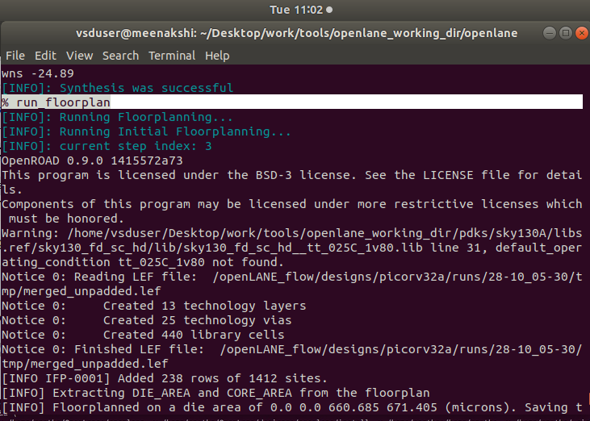
*Figure 1: Floorplan execution showing die area calculation and row creation*

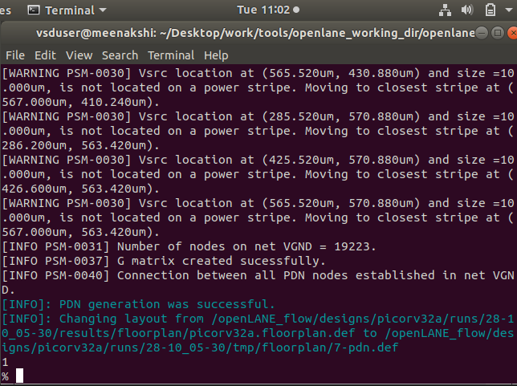
*Figure 2: Power Distribution Network generation with G-matrix creation*

### 9. Viewing Floorplan Layout
```bash
magic -T ~/Desktop/work/tools/openlane_working_dir/pdks/sky130A/libs.tech/magic/sky130A.tech \
lef read ../../tmp/merged.lef \
def read picorv32a.floorplan.def &
```
**Explanation:** Opens the Magic VLSI layout viewer to visualize the floorplan with:
- Technology file for layer definitions
- Merged LEF file containing cell abstracts
- DEF file with floorplan geometry

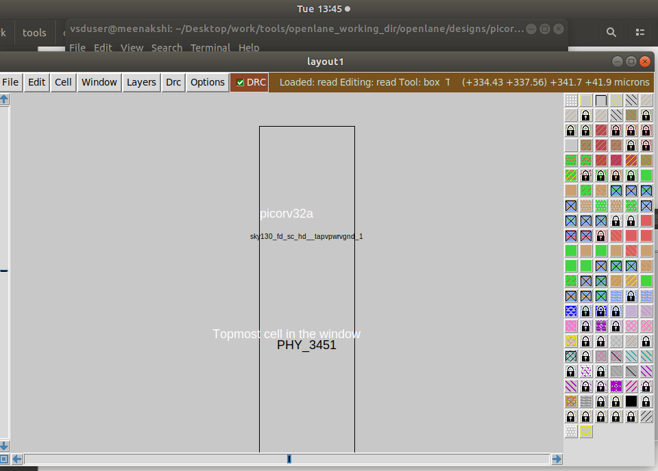
*Figure 3: Magic layout showing empty core area with placement rows and tap cells*

---

## Part 3: Placement

### 10. Run Placement
```tcl
% run_placement
```
**Explanation:** Executes the placement stage which positions all 21,699 standard cells from the synthesized netlist onto the floorplan rows through:
- **Global Placement:** Spreads cells across core area minimizing Half-Perimeter Wirelength (HPWL)
- **Legalization:** Snaps cells to legal row sites ensuring no overlaps
- **Detailed Placement:** Fine-tunes cell positions with cell mirroring and swapping

#### Key Metrics:
- **Total Instances:** 21,699 standard cells
- **Utilization:** 55% (intentionally leaving whitespace for CTS and routing)
- **Original HPWL:** 766,080.0 µm
- **Legalized HPWL:** 779,196.5 µm (2% increase is expected)
- **Mirrored Instances:** 6,193 cells flipped for optimization
- **Output Files:** `picorv32a.placement.def`


*Figure 4: Placement analysis showing utilization and HPWL metrics*

### 11. Viewing Placement Layout
```bash
magic -T ~/Desktop/work/tools/openlane_working_dir/pdks/sky130A/libs.tech/magic/sky130A.tech \
lef read ../../tmp/merged.lef \
def read picorv32a.placement.def &
```
**Explanation:** Opens Magic to visualize the placed design showing the "sea of cells" filling 55% of the core area.

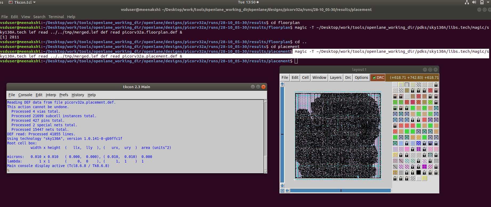
*Figure 5: Bird's eye view of placed design showing dense cell population*

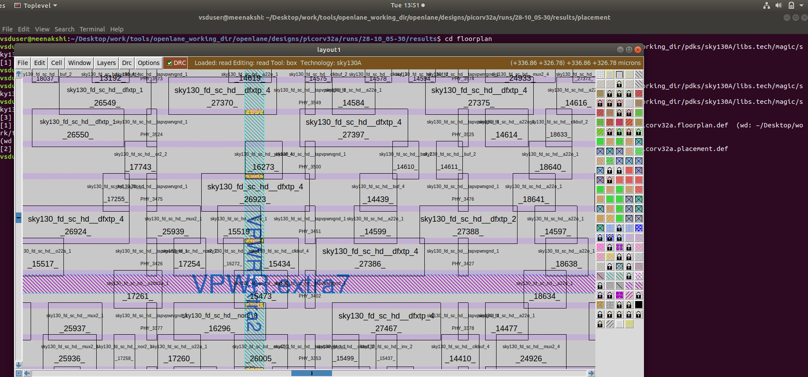
*Figure 6: Zoomed view showing individual standard cells (DFFs, buffers, gates) on placement rows with visible whitespace*

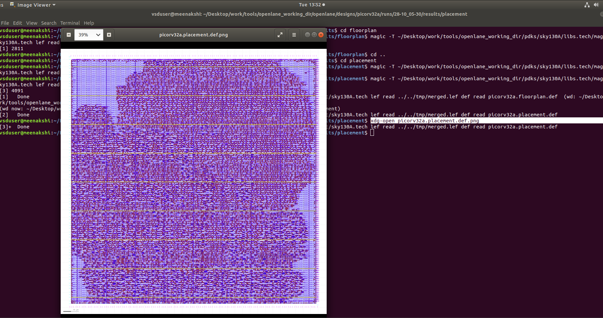
*Figure 7: Auto-generated PNG screenshot of placement layout*

---

## Part 4: Clock Tree Synthesis (CTS)

### 12. Run Clock Tree Synthesis
```tcl
% run_cts
```
**Explanation:** Executes TritonCTS to build a balanced clock distribution network that:
- Identifies all clock sinks (flip-flops and sequential elements)
- Inserts clock buffers to minimize clock skew
- Balances latency across all clock paths
- Ensures simultaneous clock arrival at all registers

#### Key Characteristics:
- **Tool Used:** TritonCTS (OpenROAD)
- **Clock Net:** `clk` 
- **Buffer Types:** `sky130_fd_sc_hd__clkbuf_1`, `sky130_fd_sc_hd__clkbuf_2`, `sky130_fd_sc_hd__clkbuf_4`
- **Goal:** Minimize clock skew (difference in arrival times)
- **Output Files:** `picorv32a.cts.def`

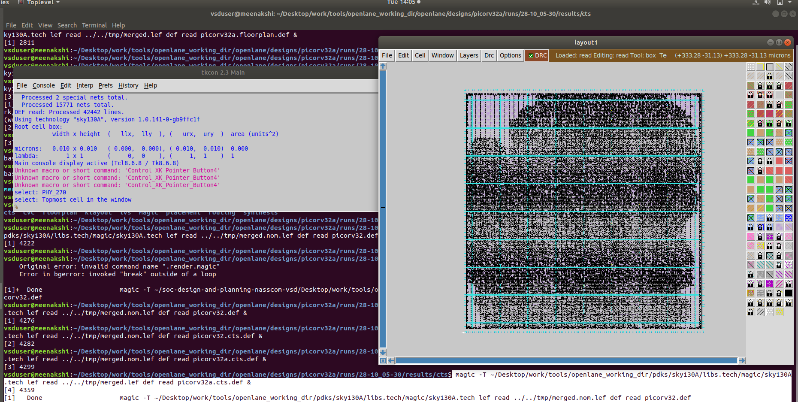
*Figure 8: TritonCTS execution showing clock net identification and characterization*

### 13. Viewing CTS Layout
```bash
magic -T ~/Desktop/work/tools/openlane_working_dir/pdks/sky130A/libs.tech/magic/sky130A.tech \
lef read ../../tmp/merged.lef \
def read picorv32a.cts.def &
```
**Explanation:** Opens Magic to view the layout after CTS, showing newly inserted clock buffers in the previously reserved whitespace.

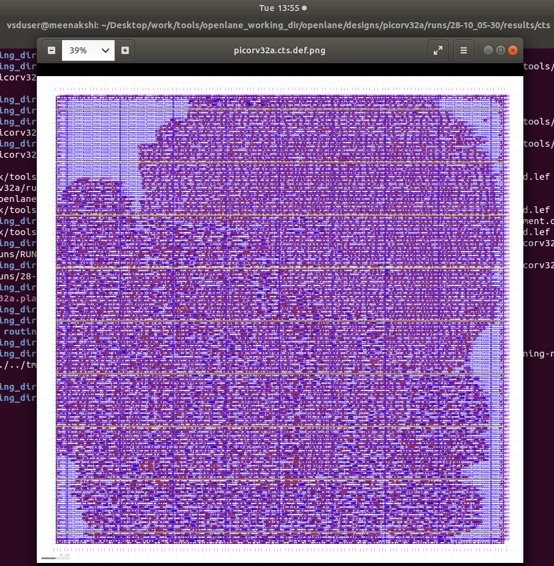
*Figure 9: Post-CTS layout showing increased density from added clock buffers*

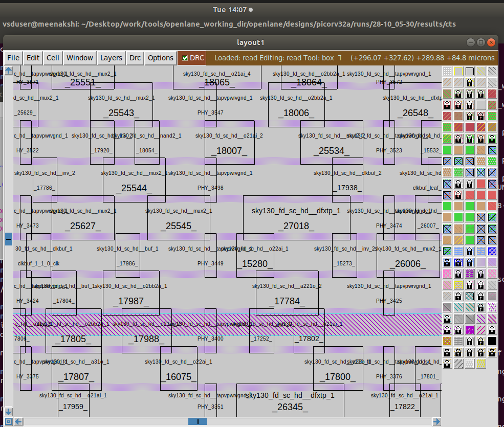
*Figure 10: Zoomed view showing inserted clock buffers (clkbuf_1, clkbuf_2) within whitespace between logic cells*

---

## Part 5: Routing

### 14. Run Routing
```tcl
% run_routing
```
**Explanation:** Executes TritonRoute to connect all cell pins with metal wires through:
- **Global Routing:** Creates high-level routing guides through 3D grid (g-cells)
- **Detailed Routing:** Draws actual metal traces on layers (li1, met1-met5)
- **Via Insertion:** Adds vias to connect between metal layers
- **DRC Fixing:** Ensures all design rules are met
- **Filler Cell Insertion:** Fills remaining gaps with decap/filler cells

#### Key Characteristics:
- **Tool Used:** TritonRoute (OpenROAD)
- **Metal Layers:** li1 (local interconnect), met1-met5 (5 metal layers)
- **Goal:** Zero DRC violations, minimal congestion
- **Output Files:** `picorv32a.def`, `picorv32a.gds` (final GDSII for fabrication)

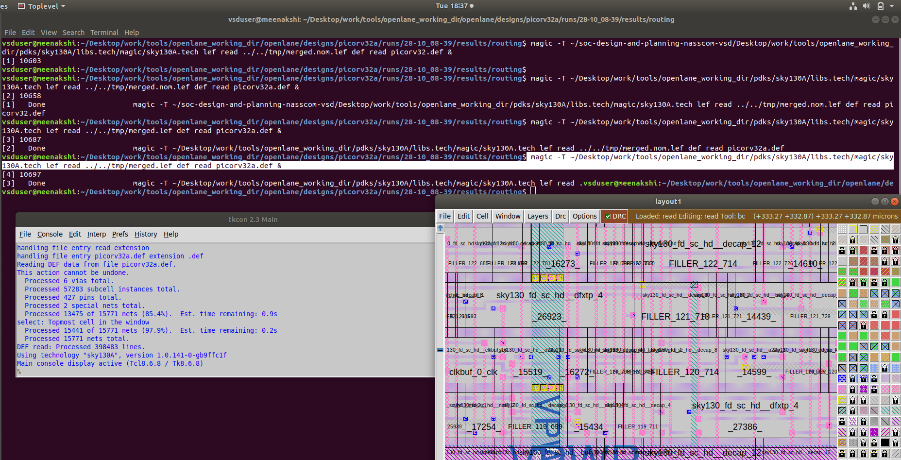
*Figure 11: Routing progress showing net processing and DRC checking*

### 15. Viewing Final Routed Layout
```bash
magic -T ~/Desktop/work/tools/openlane_working_dir/pdks/sky130A/libs.tech/magic/sky130A.tech \
lef read ../../tmp/merged.lef \
def read picorv32a.def &
```
**Explanation:** Opens Magic to view the fully routed design with all metal interconnections and filler cells.


*Figure 12: Detailed view showing routed metal traces, standard cells, clock buffers, and filler cells*


*Figure 13: Complete chip layout showing dense routing on multiple metal layers - ready for GDSII generation*

---

## Summary

This lab demonstrates the complete ASIC physical design flow from RTL to GDSII:

1. **Floorplanning** → Defined chip dimensions (660×671 µm) and power grid
2. **Placement** → Positioned 21,699 cells at 55% utilization
3. **CTS** → Built balanced clock tree with inserted buffers
4. **Routing** → Connected all cells with multi-layer metal routing

**Final Deliverable:** `picorv32a.gds` - Ready for tape-out to SkyWater 130nm foundry!

---

## Key Takeaways

- **Utilization Trade-off:** 55% utilization reserves space for CTS buffers and routing
- **Sequential Flow:** Each step builds upon previous outputs (DEF files)
- **Visualization:** Magic layout viewer is essential for verification at each stage
- **Design Rules:** PDK constraints guide every decision from floorplan to routing