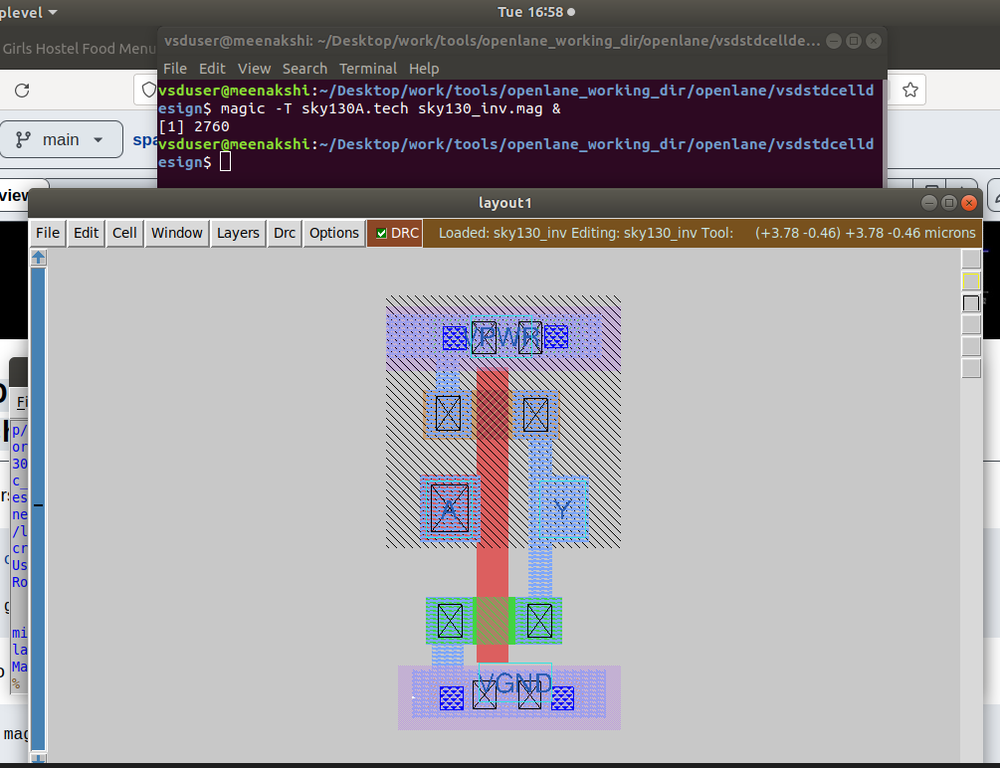
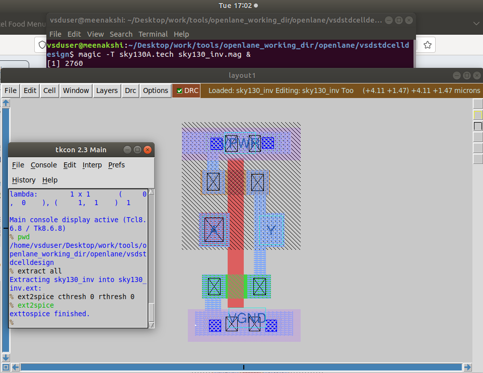
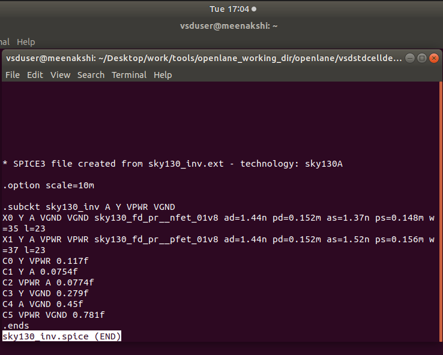
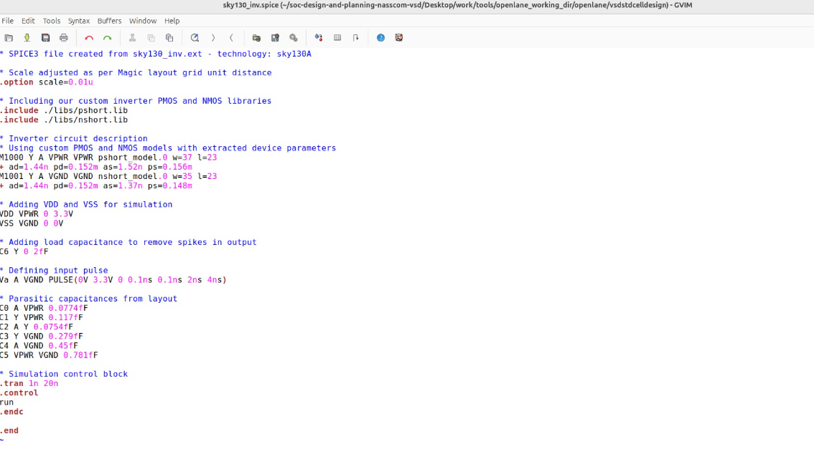
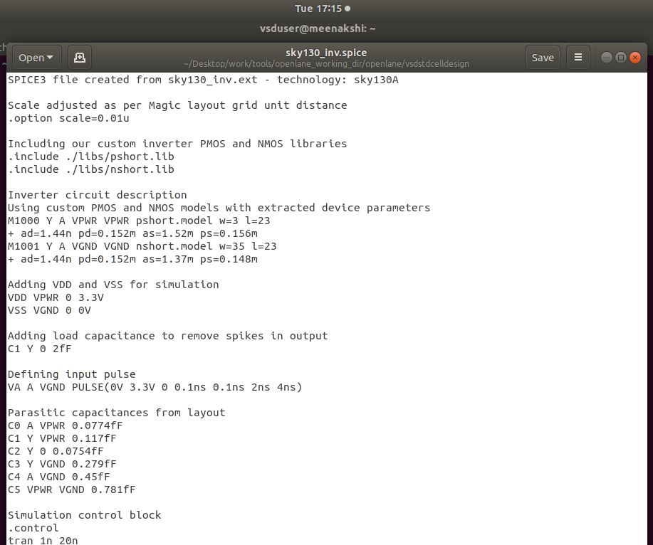

# Day 3 - Design Library Cell using Magic Layout and ngspice Characterization

## Table of Contents

- [Introduction](#introduction)
- [Standard Cell Libraries](#standard-cell-libraries)
- [Cell Design Flow](#cell-design-flow)
- [CMOS Inverter NGSPICE Labs](#cmos-inverter-ngspice-labs)
- [CMOS Fabrication Process](#cmos-fabrication-process)
- [Sky130 Layout and Extraction](#sky130-layout-and-extraction)
- [Inverter Characterization](#inverter-characterization)
- [DRC Rule Fixing](#drc-rule-fixing)
- [Advanced Topics](#advanced-topics)
- [Key Takeaways](#key-takeaways)

---

## Introduction

Day 3 focuses on creating a CMOS inverter layout using Magic and performing circuit-level characterization through NGSPICE simulation. This establishes the foundation for developing reusable, technology-compliant standard cells for ASIC libraries.

---

## Standard Cell Libraries

### What's in a Standard Cell Library?

A standard cell library contains fundamental logic gates and functional blocks that enable:
- Rapid design iteration through pre-verified components
- Predictable timing and power characteristics
- Technology portability across process nodes
- Manufacturing reliability through DRC/LVS verification

### Drive Strength Variants

| Cell | Drive | Width | Best For |
|------|-------|-------|----------|
| **X1** | 1x | W | Short wire, 1-2 fanout |
| **X2** | 2x | 2W | Medium wire, 3-5 fanout |
| **X4** | 4x | 4W | Long wire, 6-10 fanout |
| **X8** | 8x | 8W | Very long wire, high fanout |

💡 **Trade-off:** Bigger drive = More speed + More area + More power

---

## Cell Design Flow

### Phase 1: Circuit Design

**2-Input NAND Gate Example:**

```
Truth Table:          Circuit Topology:
A  B │ Y                    VDD
─────┼───                    │
0  0 │ 1              ┌──────┴──────┐
0  1 │ 1          [PMOS_A]      [PMOS_B]  ← Parallel
1  0 │ 1              │             │
1  1 │ 0              └──────┬──────┘
                             Y
                             │
                      ┌──────┴──────┐
                  [NMOS_A]      [NMOS_B]  ← Series
                      └──────┬──────┘
                            GND
```

**Critical Sizing Rules:**
1. PMOS width ≈ 2× NMOS width (mobility compensation)
2. Series transistors wider (2× minimum)
3. Balance rise/fall time symmetry

### Phase 2: Layout Design

**Layer Stack:**
- Substrate (P-type or N-type silicon)
- N-Well/P-Well (isolated regions)
- Active Area (source/drain)
- Polysilicon (gate electrodes)
- Metal Layers (interconnect)
- Via Layers (vertical connections)

**Design Checklist:**
✅ Follow ALL DRC rules
✅ Minimize cell area
✅ VDD at top, GND at bottom
✅ Grid alignment
✅ DRC + LVS verification

### Phase 3: Characterization

**Measured Parameters:**

1. **Timing:**
   - Propagation delays (rise/fall)
   - Transition times (slew rates)
   - Setup/hold times

2. **Power:**
   - Dynamic power
   - Leakage power
   - Short-circuit power

3. **Noise:**
   - Input/output noise margins
   - Cross-talk susceptibility

**Timing Definitions:**

| Parameter | Threshold | Description |
|-----------|-----------|-------------|
| `slew_low_rise_thr` | 20% VDD | Lower rise threshold |
| `slew_high_rise_thr` | 80% VDD | Upper rise threshold |
| `in_rise_thr` | 50% VDD | Input delay threshold |
| `out_rise_thr` | 50% VDD | Output delay threshold |

**Calculations:**

```
Propagation Delay = time(out_thr) - time(in_thr)
Rise Transition = time(80% VDD) - time(20% VDD)
Fall Transition = time(20% VDD) - time(80% VDD)
```

---

## CMOS Inverter NGSPICE Labs

### Lab: Clone vsdstdcelldesign Repository

```bash
cd ~/Desktop/work/tools/openlane_working_dir/openlane/
git clone https://github.com/nickson-jose/vsdstdcelldesign.git
cd vsdstdcelldesign
cp /home/vsduser/Desktop/work/tools/openlane_working_dir/pdks/sky130A/libs.tech/magic/sky130A.tech .
```

### Launch Magic Layout Viewer

```bash
magic -T sky130A.tech sky130_inv.mag &
```


*Figure 1: Magic layout viewer showing the CMOS inverter layout with terminal command*

**Layer Identification:**
- 🟦 N-well (PMOS body)
- 🟩 Diffusion (source/drain)
- 🟥 Polysilicon (gates)
- 🟨 Metal layers
- ⚫ Contacts

---

## CMOS Fabrication Process

### 16-Mask CMOS Process Overview

**1. Substrate Preparation**
- Premium silicon wafer
- Chemical cleaning (RCA process)
- Surface inspection

**2. N-Well Formation**
- Phosphorus ion implantation
- Energy: 100-400 keV
- Dose: 10¹²-10¹³ atoms/cm²
- Anneal: 1000-1200°C

**3. P-Well Formation**
- Boron ion implantation
- Energy: 50-200 keV
- Independent NMOS optimization

**4. Gate Oxide Deposition**
- Thermal oxidation at 900-1100°C
- Thickness: 2-10 nm
- Critical for transistor performance

**5. Polysilicon Deposition**
- LPCVD at 550-650°C
- Thickness: 100-400 nm
- Heavily doped for low resistance

**6. LDD Formation**
- Lightly Doped Drain structures
- Reduces hot carrier effects
- Improved reliability

**7. Source/Drain Implantation**

**NMOS:** Arsenic/Phosphorus
- Dose: 10¹⁵-10¹⁶ atoms/cm²
- Energy: 20-80 keV

**PMOS:** Boron/BF₂
- Adjusted for mobility differences

**8. Contact Formation**
- RIE etching
- Barrier metal (TiN/TaN)
- Tungsten plug fill

**9. Metal Deposition**
- Al-Cu alloy or Copper
- Thickness: 500-1000 nm
- PVD or electroplating

**10. Passivation**
- SiO₂/Si₃N₄ protection
- Thickness: 500-2000 nm
- Moisture barrier

---

## Sky130 Layout and Extraction

### Extract SPICE Netlist

**In Magic tkcon console:**

```tcl
# Check DRC
tech load sky130A.tech
drc check
drc why

# Extract netlist
pwd
extract all
ext2spice cthresh 0 rthresh 0
ext2spice
```


*Figure 2: Magic tkcon console showing extraction commands and successful completion*


*Figure 8: Detailed view of extraction process with warnings and completion status*

**Generated file:** `sky130_inv.spice`


*Figure 3: Generated SPICE netlist showing subcircuit definition with parasitic capacitances*

### Modified SPICE Deck for Characterization


*Figure 4: Edited SPICE netlist in GVIM with proper simulation setup*

```spice
* SPICE3 netlist for sky130_inv
.option scale=0.01u

.include ./libs/pshort.lib
.include ./libs/nshort.lib

* Subcircuit
M1000 Y A VPWR VPWR pshort_model.0 w=37 l=23
M1001 Y A VGND VGND nshort_model.0 w=35 l=23

* Power supplies
VDD VPWR 0 3.3V
VSS VGND 0 0V

* Input stimulus
Va A VGND PULSE(0V 3.3V 0 0.1ns 0.1ns 2ns 4ns)

* Load capacitance
C_load Y VGND 2fF

* Transient analysis
.tran 0.01ns 20ns

.control
run
plot V(A) V(Y)
.endc

.end
```


*Figure 5: Complete SPICE deck ready for ngspice simulation*

### Run NGSPICE Simulation

```bash
ngspice sky130_inv.spice
```

**In ngspice:**
```
ngspice 1 -> plot y vs time a
```


*Figure 6: NGSPICE simulation showing inverter waveforms - input (A) and output (Y)*

---

## Inverter Characterization

### Rise Transition Time

**Formula:** `Rise Time = T₈₀% − T₂₀%`

**For VDD = 3.3V:**
- 20% threshold: 0.66V
- 80% threshold: 2.64V

**Measurements:**
- T₂₀% = 6.16138 ns
- T₈₀% = 6.20366 ns
- **Rise Time = 42.2 ps** ✅

### Fall Transition Time

**Formula:** `Fall Time = T₂₀% − T₈₀%`

**Measurements:**
- T₈₀% = 8.04034 ns
- T₂₀% = 8.06818 ns
- **Fall Time = 27.8 ps** ✅

### Rise Cell Delay (t_pLH)

**Formula:** `Time(output 50%) − Time(input 50%)`

**Measurements:**
- Input falling to 50%: 2.15000 ns
- Output rising to 50%: 2.18449 ns
- **Rise Delay = 34.0 ps** ✅

### Fall Cell Delay (t_pHL)

**Formula:** `Time(output 50%) − Time(input 50%)`

**Measurements:**
- Input rising to 50%: 4.05001 ns
- Output falling to 50%: 4.05432 ns
- **Fall Delay = 4.3 ps** ✅

### Characterization Summary

| Parameter | Value | Rating |
|-----------|-------|--------|
| Rise Transition | 42.2 ps | ✅ Fast |
| Fall Transition | 27.8 ps | ✅ Very Fast |
| Rise Delay | 34.0 ps | ✅ Good |
| Fall Delay | 4.3 ps | ✅ Excellent |
| Delay Ratio | 7.9:1 | ⚠️ Asymmetric |

**Note:** Asymmetry indicates NMOS is stronger than PMOS (typical design).

---

## DRC Rule Fixing

### Download DRC Test Files

```bash
cd ~
wget http://opencircuitdesign.com/open_pdks/archive/drc_tests.tgz
tar xfz drc_tests.tgz
cd drc_tests
magic -d XR &
```

### Fix poly.9 Rule

**poly.9 Rule:** Poly resistor spacing to poly/diff ≥ 0.48 µm

**Problem:** Rule not enforced in original tech file

**Solution - Add to sky130A.tech:**

```tcl
# Poly.9 rule: npres to alldiff spacing
spacing npres alldiff 480 touching_illegal \
    "poly.9 (poly resistor spacing to diffusion < 0.48um)"

# Poly.9 rule: npres to allpolynonres spacing  
spacing npres allpolynonres 480 touching_illegal \
    "poly.9 (poly resistor spacing to poly < 0.48um)"
```

**Verify fix:**

```tcl
tech load sky130A.tech
drc check
drc why
```

---

## Advanced Topics

### PVT Corner Analysis

| Corner | Process | Temp | Voltage | Use Case |
|--------|---------|------|---------|----------|
| **SS** | Slow-Slow | 125°C | 0.95V | Max delay (setup) |
| **TT** | Typical | 25°C | 1.0V | Typical performance |
| **FF** | Fast-Fast | -40°C | 1.05V | Min delay (hold) |
| **SF** | Slow-Fast | Hot | Low | Skewed timing |
| **FS** | Fast-Slow | Cold | High | Skewed timing |

**Total characterization points:** 5 corners × 3 temps × 3 voltages × 7 slews × 7 loads = **2,205 simulations per cell**

### Output File Formats

**LEF (Library Exchange Format):**
- Physical abstract for P&R
- Pin locations, cell boundaries
- No transistor details (IP protection)

**.lib (Liberty Timing):**
- Timing lookup tables
- Power models
- Functional descriptions
- PVT-specific

**GDSII:**
- Complete layout geometry
- All layers and polygons
- For mask fabrication

**SPICE Netlist:**
- Circuit connectivity
- Parasitic R/C
- For simulation/LVS

---

## Key Takeaways

### Technical Skills Developed

✅ **Layout Design:** Magic tool proficiency, layer stack understanding
✅ **Circuit Simulation:** NGSPICE setup and waveform analysis
✅ **Characterization:** Timing parameter measurement and calculation
✅ **DRC Debugging:** Tech file modification and rule validation
✅ **File Formats:** LEF, .lib, GDSII, SPICE understanding

### Design Flow Mastery

✅ **Complete workflow:** Layout → Extract → Simulate → Characterize
✅ **Verification:** DRC, LVS, timing checks
✅ **Tool Integration:** Magic + NGSPICE + characterization
✅ **Industry practices:** Standard methodologies and deliverables

### Critical Concepts

✅ **Drive strength variants** balance speed/area/power
✅ **PVT corners** ensure robust design across conditions
✅ **Parasitic extraction** captures real-world effects
✅ **Multi-dimensional LUTs** model complex timing behavior
✅ **Design rules** ensure manufacturability

---

## Next Steps - Day 4 Preview

📌 Pre-Layout Timing Analysis
📌 Static Timing Analysis (STA)
📌 Clock Tree Synthesis (CTS)
📌 Cell Integration into OpenLANE Flow

---

**Documentation References:**
- [Sky130 PDK](https://skywater-pdk.readthedocs.io/)
- [Magic VLSI Tool](http://opencircuitdesign.com/magic/)
- [Ngspice Manual](http://ngspice.sourceforge.net/docs.html)
- [Liberty Format](https://people.eecs.berkeley.edu/~alanmi/publications/other/liberty07_03.pdf)

---

*End of Day 3 - Standard Cell Design & Characterization*